# Backend Stack: Bun + Elysia

Source URL: Internal draft
Collected: 2026-04-15
Published: 2026-04-15
Updated: 2026-05-22
Status: Draft
Scope: Standalone Bun + Elysia backend APIs, SaaS dashboards, mobile APIs, public APIs, webhooks, async workers, and self-hosted VPS deployments

---

## 20. Backend API Stack

### 20.1 Framework: Elysia

**Elysia** is the mandatory HTTP framework for standalone backend API servers.

Use Elysia-first architecture when one or more of these are true:
- the product exposes a separate backend API to a Vite dashboard, mobile app, machine client, or third-party system
- the product needs a public or partner-facing API surface
- the product uses webhooks, queues, media processing, push notifications, or long-running async services
- the product needs realtime server-to-client updates such as notifications or job progress
- the backend must be independently deployable and observable on a VPS

Do not use Express, Hono, Fastify, Koa, NestJS, Next.js route handlers, or frontend server functions for standalone API projects adopting this stack.

### 20.2 Product Profiles

Backend projects use one of two profiles at project initialization. The framework, directory layout, deployment model, and core libraries are the same; defaults differ by consumer type.

| Profile | Consumer | Default posture |
|---|---|---|
| `internal-api` | Dashboard, mobile app, internal operators, first-party machine clients | User JWT, workspace RBAC, internal docs, faster breaking-change cadence |
| `public-api` | External developers, partners, customer systems, public machine clients | API clients, scopes, stable versioning, stricter rate limits, deprecation windows, customer webhooks |

Rules:
- A single backend project is initialized as either internal or public, not both by default.
- Both profiles expose REST JSON APIs under `/api/v1`.
- Both profiles generate OpenAPI 3.1 specs.
- Both profiles use JWT, JWKS, RBAC, scopes, Redis, BullMQ, PostgreSQL, Drizzle, Pino, OpenTelemetry, and Docker Compose.
- Public API projects must treat the API contract as long-lived and externally consumed.

### 20.3 Architecture Overview

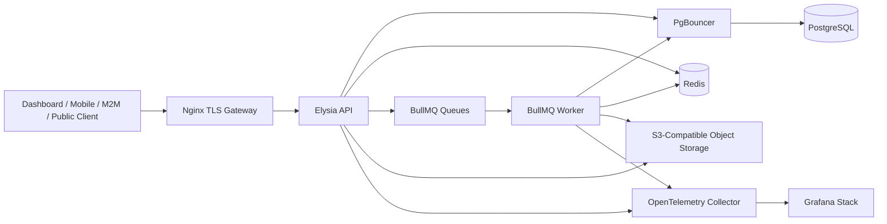

Rules:
- Nginx is the only host-facing service in staging and production.
- The API container exposes its port only inside the Docker network.
- Workers are separate runtime processes from the API server.
- Redis and BullMQ are mandatory from day one.
- Object storage is mandatory for media-capable products; never store file blobs in PostgreSQL.

### 20.4 API Design: REST + OpenAPI

**Style:** RESTful JSON APIs with OpenAPI 3.1 generated automatically by Elysia's `@elysiajs/openapi` plugin.

OpenAPI is the official contract for dashboards, mobile apps, public SDKs, third-party clients, and CI drift checks. Eden Treaty is allowed only for internal TypeScript-only tooling and must not be the official public or dashboard contract.

Install:

```bash
bun add @elysiajs/openapi
```

Recommended setup:

```typescript
import { Elysia } from 'elysia'
import { openapi } from '@elysiajs/openapi'

export const app = new Elysia()
  .use(
    openapi({
      enabled: process.env.API_DOCS_ENABLED === 'true',
      path: '/docs',
      documentation: {
        info: {
          title: 'Example API',
          version: '1.0.0',
          description: 'REST API for an example SaaS product'
        },
        components: {
          securitySchemes: {
            bearerAuth: {
              type: 'http',
              scheme: 'bearer',
              bearerFormat: 'JWT'
            }
          }
        }
      }
    })
  )
```

Rules:
- Use `@elysiajs/openapi`, not deprecated Swagger plugins.
- Mount Scalar UI at `/docs`.
- Raw OpenAPI JSON is exposed at `/docs/json` when docs are enabled.
- Disable or auth-gate `/docs` and `/docs/json` in production.
- Version APIs by URL prefix: `/api/v1`, `/api/v2`.
- Never version APIs by header or query parameter.
- Health, readiness, metrics, admin, and internal worker endpoints must be hidden from consumer OpenAPI specs unless explicitly intended.
- Every controller group defines OpenAPI tags and security metadata.

OpenAPI client contract:

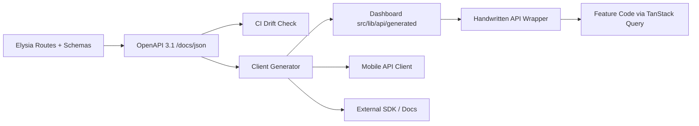

#### 20.4.1 API Versioning And Deprecation

API versioning uses URL path prefixes only.

Rules:
- Use `/api/v1`, `/api/v2`, and later version prefixes.
- Do not version APIs by header, query parameter, hostname, or content negotiation.
- Internal API projects may ship breaking changes faster, but generated dashboard/mobile clients must be updated in the same change set.
- Public API projects must treat every documented endpoint, request schema, response schema, error code, and webhook payload as externally consumed.
- Public API breaking changes require a new version prefix unless an explicit customer migration plan is approved.
- Non-breaking changes include adding optional request fields, adding response fields, adding new endpoints, adding enum values only when clients are documented to tolerate unknown values, and increasing documented limits.
- Breaking changes include removing fields, renaming fields, changing field types, making optional fields required, removing enum values, changing auth/scopes, changing pagination semantics, or changing error codes for the same failure mode.

Public API deprecation lifecycle:
- Announce deprecations in docs and changelog before enforcement.
- Return `Deprecation` and `Sunset` headers for deprecated public endpoints when practical.
- Keep old public API versions available for the product-defined migration window.
- The default public API migration window is 90 days unless the project ADR defines a stricter or longer period.
- Emergency security removals may bypass the migration window, but require an incident note and customer communication.

OpenAPI drift rules:
- CI generates the OpenAPI spec from Elysia routes.
- CI compares the generated spec against the committed or published contract.
- Public API CI blocks accidental breaking changes.
- Internal API CI blocks dashboard/mobile client drift.
- Every public API change updates docs, examples, and SDK generation inputs in the same PR.

### 20.5 Response Envelope And Error Registry

All API responses use a standard envelope.

Success:

```json
{
  "success": true,
  "data": {},
  "meta": {
    "page": 1,
    "pageSize": 20,
    "total": 450,
    "totalPages": 23
  }
}
```

Error:

```json
{
  "success": false,
  "error": {
    "code": "VALIDATION_ERROR",
    "message": "Please check the highlighted fields.",
    "details": [
      { "field": "email", "message": "Invalid email address" }
    ]
  }
}
```

Rules:
- Error codes are stable `SCREAMING_SNAKE_CASE` constants defined in `src/types/errors.ts`.
- Never return raw Elysia validation errors, Zod internals, SQL errors, stack traces, provider diagnostics, or exception messages to clients.
- Field-level API errors map back to fields where possible.
- Every response includes or is correlated with `X-Request-ID`.
- Internal errors are logged with `request_id`, `trace_id`, safe error metadata, and no PII.

#### 20.5.1 Error Code Registry

Error codes are part of the API contract. They must be stable, documented, and safe to expose.

Baseline registry:

| HTTP status | Code | Meaning |
|---|---|---|
| `400` | `BAD_REQUEST` | Request is malformed or cannot be parsed safely |
| `400` | `VALIDATION_ERROR` | Request shape is syntactically valid but fails schema/domain validation |
| `401` | `UNAUTHENTICATED` | Missing, invalid, expired, or revoked credentials |
| `403` | `FORBIDDEN` | Authenticated principal lacks required role, scope, workspace membership, or resource access |
| `404` | `NOT_FOUND` | Resource does not exist or must be hidden from this principal |
| `409` | `CONFLICT` | Request conflicts with current resource state or uniqueness constraints |
| `409` | `IDEMPOTENCY_CONFLICT` | Same idempotency key was reused with a different request hash |
| `413` | `PAYLOAD_TOO_LARGE` | Request body or declared upload exceeds configured limits |
| `415` | `UNSUPPORTED_MEDIA_TYPE` | Content type is not accepted by the endpoint |
| `422` | `UNPROCESSABLE_ENTITY` | Valid JSON cannot be processed because domain preconditions fail |
| `429` | `RATE_LIMITED` | Request exceeded a configured rate limit policy |
| `500` | `INTERNAL_ERROR` | Unexpected server failure |
| `503` | `SERVICE_UNAVAILABLE` | Required dependency is unavailable or the service is temporarily unable to handle requests |
| `503` | `SERVICE_SHUTTING_DOWN` | Process is draining and not accepting new work |

Rules:
- Do not invent one-off error codes inside controllers.
- Add new codes to `src/types/errors.ts` and public docs before using them.
- Public API clients must be able to branch on `error.code` without parsing `message`.
- Error `message` is human-readable but not a stable machine contract.
- Use `details` for field-specific validation and structured retry hints.
- Do not expose SQL constraint names, stack traces, provider raw errors, token parser internals, or authorization policy internals.

### 20.6 Authentication: JWT-First With JOSE

JWT is the standard authentication mechanism for dashboard, mobile, machine-to-machine, and public API access.

Use `jose` as the core JWT/JWK/JWKS implementation.

Rules:
- Use asymmetric JWT signing in production.
- Prefer `EdDSA` where runtime support is clean; use `RS256` as the compatibility fallback.
- `HS256` is banned for production SaaS/public API JWTs unless an ADR explicitly approves it.
- Every JWT includes a `kid` protected header.
- Verify issuer, audience, expiration, signature, and required claims on every protected request.
- Access tokens are short-lived.
- User refresh tokens use rotation and revocation.
- Machine tokens are scoped, revocable, and expire.
- API keys are hashed at rest and shown only once at creation.
- Do not store bearer access tokens in localStorage for dashboard apps unless a security ADR accepts the risk and mitigation.

#### 20.6.1 CORS, Cookies, And CSRF

Backend APIs default to explicit origin allowlists and bearer-token authorization.

CORS rules:
- `CORS_ALLOWED_ORIGINS` is required for dashboard/mobile-web/browser clients.
- Do not use wildcard `Access-Control-Allow-Origin: *` for authenticated APIs.
- Never combine wildcard origins with credentials.
- Allow only required methods and headers.
- Include `Authorization`, `Content-Type`, `Idempotency-Key`, and `X-Request-ID` only when the API uses them.
- Use `Access-Control-Max-Age` for preflight caching, but keep it short enough for configuration changes to propagate.
- Production CORS origins must be exact origins, not broad domain suffixes.
- Local development may allow `http://localhost:<port>` values from `.env` only.

Token transport rules:
- Machine clients and public API clients use `Authorization: Bearer <token>` or hashed API keys where specified.
- Dashboard and mobile clients should use short-lived bearer access tokens plus refresh rotation.
- Do not store bearer access tokens in browser localStorage unless a security ADR explicitly accepts the risk.
- If browser cookies are used for auth, they must be `HttpOnly`, `Secure` in non-local environments, and `SameSite=Lax` or `SameSite=Strict` unless an ADR approves `SameSite=None`.

CSRF rules:
- Bearer-token-only APIs that do not authenticate via ambient cookies do not require CSRF tokens.
- Any endpoint authenticated by browser cookies must require CSRF protection for unsafe methods: `POST`, `PUT`, `PATCH`, and `DELETE`.
- CSRF tokens must be bound to the session or refresh-token family and validated server-side.
- CORS is not a CSRF defense.
- SameSite cookies reduce CSRF risk but do not replace CSRF tokens for cookie-authenticated unsafe writes.

Recommended user access token claims:

```json
{
  "sub": "user_123",
  "typ": "user",
  "workspace_id": "ws_123",
  "roles": ["admin"],
  "scopes": [],
  "jti": "token_123",
  "iss": "https://api.example.com",
  "aud": "example-api",
  "iat": 1779400000,
  "exp": 1779400900
}
```

Recommended machine token claims:

```json
{
  "sub": "client_123",
  "typ": "machine",
  "workspace_id": "ws_123",
  "scopes": ["orders.read", "orders.write"],
  "jti": "token_456",
  "iss": "https://api.example.com",
  "aud": "example-api",
  "iat": 1779400000,
  "exp": 1779403600
}
```

### 20.7 JWK, JWKS, And Key Rotation

All production JWT signing keys use JOSE-compatible JWK material and expose public verification keys through JWKS.

Rules:
- Private signing keys are stored in Vault or the approved secrets manager.
- Public keys are exposed via `/.well-known/jwks.json`.
- JWT protected headers include `alg`, `kid`, and `typ: "JWT"`.
- JWKS publishes only public keys.
- Old public keys remain in JWKS until the maximum token lifetime plus a safety window has elapsed.
- Emergency key compromise requires disabling the compromised `kid`, revoking affected refresh tokens, and forcing re-auth where needed.

Key rotation flow:

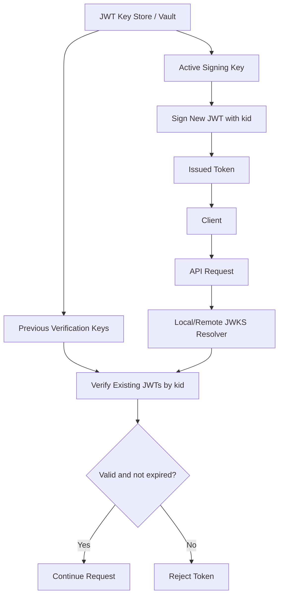

### 20.8 Authorization: RBAC, Scopes, And Tenant Isolation

RBAC is mandatory for all SaaS backend APIs.

Authorization layers:

| Layer | Purpose |
|---|---|
| JWT verification | Proves token authenticity and basic identity |
| Workspace membership | Proves user/client belongs to the tenant context |
| RBAC | Authorizes user actions through roles and permissions |
| Scopes | Authorizes machine and public API access |
| Resource ownership | Ensures the target resource belongs to the workspace |

Core schema concepts:

```text
users
workspaces
workspace_members
roles
permissions
role_permissions
member_roles
api_clients
api_client_scopes
```

Rules:
- Built-in roles are `owner`, `admin`, `member`, and `viewer`.
- Schema must support custom roles from day one, even if the first UI exposes only built-in roles.
- Permission constants use `<resource>.<action>`, for example `users.read`, `users.create`, `billing.manage`.
- Machine and public API clients use scopes.
- JWT role and scope claims are optimization hints, not the only authorization source of truth.
- Final authorization checks happen server-side.
- Redis may cache resolved permission sets with short TTL and explicit invalidation.

Authorization flow:

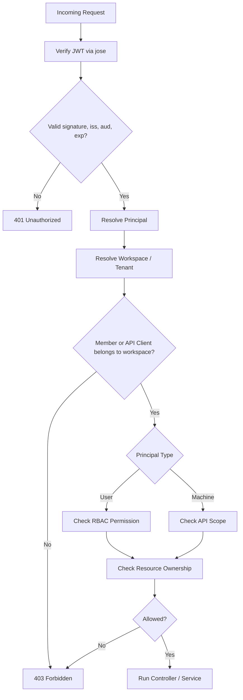

Multi-tenant data access flow:

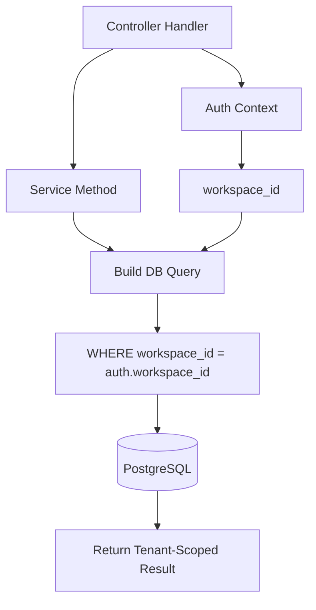

### 20.9 Validation

Elysia's TypeBox-based schema validation handles request and response boundary validation. Zod handles business/domain validation inside services.

Rules:
- Route boundary schemas are mandatory for body, query, params, and responses.
- Service-level business validation is mandatory for cross-field rules, state transitions, domain rules, and DB constraint-friendly errors.
- Frontend validation is UX only; backend validation is authoritative.
- Validation errors are mapped into the standard error envelope.

### 20.10 Database: PostgreSQL + Drizzle + PgBouncer

PostgreSQL is the mandatory relational database. Drizzle is the mandatory ORM/query builder.

Rules:
- Use Drizzle schema and migrations.
- Do not make manual production schema changes outside migrations.
- Use PgBouncer in transaction mode for staging and production.
- Application DB URLs point to PgBouncer, not directly to Postgres.
- Drizzle/Bun SQL pools are bounded per API/worker instance.
- Raw SQL strings are banned unless using Drizzle's parameterized `sql` helper with a documented reason.
- Tenant-owned tables include `workspace_id`.
- Unique constraints include `workspace_id` when uniqueness is tenant-scoped.
- Add indexes for foreign keys, tenant filters, cursor pagination, lookup columns, and high-traffic filters.

Example DB client:

```typescript
import { SQL } from 'bun'
import { drizzle } from 'drizzle-orm/bun-sql'

const sql = new SQL({
  url: process.env.DATABASE_URL,
  max: Number(process.env.DB_POOL_MAX ?? 20),
  idleTimeout: 30,
  connectionTimeout: 10
})

export const db = drizzle(sql)
```

#### 20.10.1 Migrations, Seeds, And Data Changes

Database changes use Drizzle migrations only.

Migration rules:
- Every schema change is represented as a committed migration.
- Do not edit a migration after it has been applied to staging or production.
- Do not run manual production DDL outside the migration system.
- Production migrations must be rehearsed in staging with a recent production-shaped dataset when the change is non-trivial.
- Destructive migrations require a backup, rollback plan, and explicit approval.
- Long-running migrations must be planned for lock behavior, batch size, and deployment timing.

Expand/contract pattern:
- Expand: add nullable columns, new tables, new indexes, or backward-compatible structures first.
- Deploy code that writes both old and new shapes where needed.
- Backfill data in batches through a controlled job or migration script.
- Switch reads to the new shape after backfill validation.
- Contract: remove old columns, indexes, or code paths only after the old version is no longer running.

Index and constraint rules:
- Add indexes before deploying code paths that depend on them for high-traffic queries.
- Tenant-scoped uniqueness includes `workspace_id` or the relevant tenant key.
- Prefer database constraints for invariants that must survive concurrency.
- Use application validation for user-friendly errors, but never rely on application validation alone for uniqueness or referential integrity.

Seed rules:
- Local and test seed data must be deterministic.
- Seed data must not contain real customer PII, production secrets, real API keys, or real webhook secrets.
- Staging seed data may mimic production scale and shape but must be synthetic or anonymized.
- Seeds are for setup and test repeatability, not hidden migrations.

### 20.11 Rate Limiting

Redis-backed rate limiting is mandatory.

Rate limiting uses a layered model:

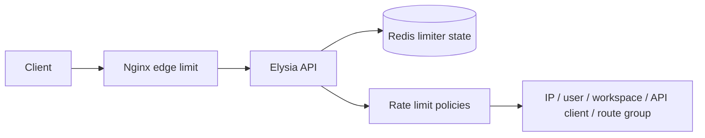

Layer responsibilities:
- Nginx owns coarse edge protection against abusive IP bursts before traffic reaches Bun.
- Elysia owns authoritative product/API limits because it can see authenticated user, workspace, API client, scopes, route group, and request cost.
- Redis owns distributed limiter state so limits are correct across multiple API containers.

Do not make `elysia-rate-limit` or any third-party plugin the controller-facing abstraction. Products define an internal limiter module, usually `src/lib/rate-limit.ts`, and controllers/macros call that internal API only. The implementation may initially wrap a maintained Redis-backed library, but application code must not depend on that library's API shape.

Recommended internal API:

```typescript
await rateLimit.check({
  policy: 'orders.read',
  subject: {
    type: 'workspace',
    id: auth.workspaceId
  },
  routeGroup: 'orders',
  cost: 1
})
```

Limit dimensions:
- IP address
- authenticated user
- workspace
- API client
- auth endpoint
- upload intent endpoint
- public API route group
- webhook endpoint where provider retry behavior allows it

Redis key shape:

```text
rl:{env}:{profile}:ip:{ip}:{routeGroup}
rl:{env}:{profile}:user:{userId}:{routeGroup}
rl:{env}:{profile}:workspace:{workspaceId}:{routeGroup}
rl:{env}:{profile}:client:{clientId}:{scopeOrRouteGroup}
```

Key rules:
- Use route groups such as `orders.read`, `auth.login`, `media.intent`, or `webhooks.inbound`, not raw URLs.
- Never include bearer tokens, API keys, emails, request bodies, or PII in Redis keys.
- Do not use resource IDs in route-group names unless the endpoint has a documented per-resource abuse case.
- Include environment and API profile so staging, production, internal API, and public API counters cannot collide.

Algorithm defaults:

| Use case | Default algorithm | Reason |
|---|---|---|
| General internal API | Sliding window counter | Smooths fixed-window boundary bursts with low Redis memory use |
| Public API client limits | Sliding window counter or token bucket | Stable quota semantics; token bucket allows controlled bursts |
| Auth login/password/API key creation | Strict sliding window or fixed window plus block duration | Prefer predictable lockout behavior over burst tolerance |
| Upload intent endpoints | Sliding window counter | Prevents storage abuse before object upload starts |
| Expensive export/import/search endpoints | Weighted sliding window counter | One expensive request can consume multiple points |
| Outbound provider calls from workers | Token bucket or leaky bucket | Protects downstream providers and smooths retries |

Policy matrix:

| Policy | Subject | Example default | Notes |
|---|---|---|---|
| Edge IP burst | IP | `20r/s` at Nginx with burst | Coarse abuse shield only |
| API IP fallback | IP + route group | `300/min/ip` | Applies before auth or when auth is absent |
| Login | IP + normalized identifier | `5/min`, block `15min` | Do not reveal whether the identifier exists |
| Token refresh | user or client | `30/min` | Fail closed if limiter is unavailable |
| API key creation | user + workspace | `5/hour` | Prevents key churn and brute-force naming flows |
| Workspace API | workspace + route group | product-specific | Protects shared tenant resources |
| Public API client | API client + scope/route group | plan-specific | Must be documented in public API docs |
| Upload intent | user + workspace | `10/min/user`, `100/hour/workspace` | Actual blob transfer still goes to object storage |
| Webhook inbound | provider + endpoint | provider-specific | Avoid breaking legitimate provider retries |
| Export/import | user + workspace + route group | weighted points | Long-running work must also be queued |

Elysia integration:

```text
onRequest
  -> derive request id and client IP
  -> apply coarse Redis-backed IP/route-group limit when useful
  -> reject early with 429 if exceeded

auth resolve / guard
  -> verify JWT, API key, or webhook signature
  -> derive user, workspace, API client, scopes, and route group

macro / beforeHandle
  -> apply policy-specific user/workspace/client limiter
  -> attach rate limit headers
  -> continue to handler only if allowed
```

Minimal Elysia shape:

```typescript
import { Elysia } from 'elysia'
import { rateLimit } from './lib/rate-limit'
import { rateLimited } from './lib/response'

export const rateLimitPlugin = new Elysia({ name: 'rate-limit' })
  .onRequest(async ({ request, set }) => {
    const result = await rateLimit.checkIp({
      ip: request.headers.get('x-real-ip') ?? 'unknown',
      routeGroup: 'global'
    })

    if (!result.allowed) {
      set.status = 429
      set.headers['Retry-After'] = String(result.retryAfterSeconds)
      set.headers['RateLimit-Limit'] = String(result.limit)
      set.headers['RateLimit-Remaining'] = '0'
      set.headers['RateLimit-Reset'] = String(result.resetAtUnix)
      return rateLimited(result.retryAfterSeconds)
    }
  })
  .macro(({ onBeforeHandle }) => ({
    rateLimit(policy: string) {
      onBeforeHandle(async ({ auth, set }) => {
        const result = await rateLimit.check({
          policy,
          subject: auth.apiClientId
            ? { type: 'client', id: auth.apiClientId }
            : { type: 'workspace', id: auth.workspaceId },
          routeGroup: policy,
          cost: 1
        })

        set.headers['RateLimit-Limit'] = String(result.limit)
        set.headers['RateLimit-Remaining'] = String(result.remaining)
        set.headers['RateLimit-Reset'] = String(result.resetAtUnix)

        if (!result.allowed) {
          set.status = 429
          set.headers['Retry-After'] = String(result.retryAfterSeconds)
          return rateLimited(result.retryAfterSeconds)
        }
      })
    }
  }))
```

Rules:
- Return HTTP `429 Too Many Requests` with `Retry-After`.
- Return `RateLimit-Limit`, `RateLimit-Remaining`, and `RateLimit-Reset` on limited route groups when feasible.
- Map limiter denials into the standard error envelope with error code `RATE_LIMITED`.
- Public API rate limits are stricter and must be documented.
- Login, token refresh, password reset, API key creation, and upload intent endpoints get stricter limits than ordinary reads.
- Rate limit counters must not use high-cardinality labels in telemetry.
- Limiter code must use low-latency Redis operations and short timeouts. Do not let Redis limiter calls hang request handling.
- Redis clients used by the limiter must not queue unbounded work during outages.
- Auth, token refresh, API key creation, unsafe writes, upload intent, and public API limits fail closed when Redis is unavailable.
- Low-risk authenticated reads may fail open only when explicitly documented in the project ADR.
- Workers use separate outbound limiter policies for external providers; do not reuse inbound HTTP policies for outbound provider traffic.

Standard rate limit error:

```json
{
  "success": false,
  "error": {
    "code": "RATE_LIMITED",
    "message": "Too many requests. Please retry later.",
    "details": [
      { "field": "retryAfterSeconds", "message": "60" }
    ]
  }
}
```

Telemetry:
- `rate_limit_checks_total`
- `rate_limit_allowed_total`
- `rate_limit_denied_total`
- `rate_limit_redis_errors_total`
- `rate_limit_latency_ms`

Allowed labels:
- `policy`
- `subject_type`
- `route_group`
- `api_profile`
- `result`

Forbidden labels:
- raw IP address
- user ID
- workspace ID
- API key or client secret
- raw URL path
- email or phone number

### 20.12 Idempotency

Idempotency is mandatory for unsafe writes and external/public API side effects.

Rules:
- Use `Idempotency-Key` for side-effecting public API `POST` requests.
- Store request hash, actor, route, status, and response summary in PostgreSQL or Redis with durable fallback where needed.
- Same key plus same payload returns the original result.
- Same key plus different payload returns a conflict.
- Required for payments, orders, imports, media completion, external writes, webhook processing, and irreversible actions.

### 20.13 Pagination, Filtering, And Sorting

Rules:
- All list endpoints are paginated.
- Use offset pagination for bounded master data.
- Use cursor pagination for fast-growing transactional data.
- Enforce server-side maximum page size.
- Sorting must be stable and deterministic.
- Filters, search, sort, page, and page size must be represented in OpenAPI.
- Response `meta` uses consistent names so dashboard TanStack Query/Table integrations remain predictable.

### 20.14 Redis And BullMQ

Redis and BullMQ are mandatory from day one.

Use BullMQ for:
- email sending
- webhook processing
- push notification fanout
- media processing
- imports/exports
- retries against external providers
- scheduled background work

Rules:
- Queue names and job names are constants.
- Job payloads are schema-validated.
- Workers call the same `services/` layer as HTTP controllers.
- Do not duplicate business logic inside workers.
- Jobs are idempotent.
- Default retries use exponential backoff.
- Failed terminal jobs move to a dead-letter or failed state and trigger alerts.
- Trace context is propagated from HTTP request to BullMQ job payload or metadata.
- Bull Board or any queue UI must be auth-gated and hidden from public OpenAPI.

Job flow:

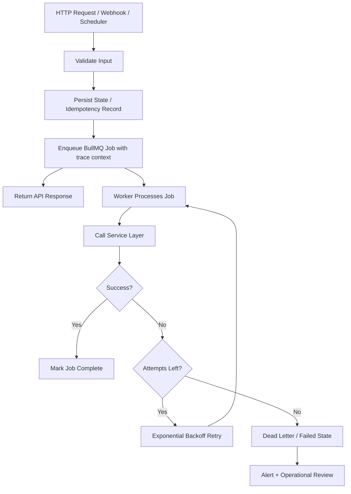

#### 20.14.1 Caching Strategy

Redis caching is an optimization layer. PostgreSQL remains the source of truth for durable business data.

Cacheable data:
- permission resolution results with short TTL and explicit invalidation
- workspace membership lookups
- master/reference data that changes infrequently
- expensive read models that are safe to serve slightly stale
- idempotency in-progress guards where Redis durability is acceptable for the specific flow
- short-lived provider metadata that can be safely refetched

Do not cache by default:
- raw access tokens, refresh tokens, API keys, or client secrets
- unredacted PII
- payment card data or regulated secrets
- authorization decisions without tenant scope and invalidation
- mutable business records where stale reads can cause wrong side effects

Key rules:
- Prefix cache keys with environment, product/profile, tenant/workspace where relevant, and purpose.
- Do not use raw URLs as cache keys for authenticated endpoints.
- Do not include bearer tokens, cookies, emails, phone numbers, request bodies, or PII in cache keys.
- Use route groups and stable identifiers instead of unbounded high-cardinality text.

TTL defaults:

| Cache type | Default TTL |
|---|---:|
| Permission and membership cache | `30s` to `5m` |
| Master/reference data | `5m` to `1h` |
| Expensive read model | `30s` to `10m` |
| External provider metadata | provider-specific, usually `5m` to `1h` |
| Idempotency in-progress guard | aligned with request timeout plus retry window |

Invalidation rules:
- Permission and membership changes must invalidate affected permission cache keys.
- Role changes invalidate user, workspace, and API-client permission caches as applicable.
- Writes that change cached read models must either invalidate keys or publish a cache-busting event.
- If invalidation cannot be made reliable, use a shorter TTL and document the acceptable staleness.

Stampede protection:
- Use single-flight locking or short Redis locks for high-cost cache fills.
- Add TTL jitter to frequently accessed keys.
- Serve stale data only for read-only responses where the product accepts staleness.
- Never hold a Redis lock across network calls unless the timeout is strict and documented.

#### 20.14.2 Queue Handling, Retries, And Backoff

Queues are product infrastructure, not a dumping ground for arbitrary async code. Every queue and job type must have explicit ownership, retry behavior, timeout behavior, and failure handling.

Queue taxonomy:

| Queue class | Use for | Default posture |
|---|---|---|
| `critical` | audit-sensitive internal work, billing finalization, security notifications | low concurrency, immediate alert on failure |
| `default` | normal async product work | balanced concurrency and retries |
| `bulk` | imports, exports, media processing, large fanout | lower priority, longer timeout, checkpointed progress |
| `outbound` | email, push, customer webhooks, third-party provider calls | provider-specific rate limits and retry classification |

Job naming and payload rules:
- Job names use `domain.action.v1`, for example `media.process.v1`, `webhook.deliver.v1`, or `email.send.v1`.
- Version job names or payload schemas when changing shape in a way old workers cannot process.
- Job payloads include `schema_version`, `workspace_id` where applicable, actor context, idempotency key where applicable, and trace context.
- Job payloads must be schema-validated before enqueue and before execution.
- Job payloads must not include bearer tokens, API keys, refresh tokens, raw cookies, or unredacted PII unless an ADR approves the exception.
- Store sensitive small records in PostgreSQL; store large or binary data in object storage; pass only IDs or object keys in the job payload.

Enqueue rules:
- Persist business state before enqueueing a job.
- For critical side effects, use an outbox table or equivalent transactional enqueue pattern so DB commit and job dispatch cannot diverge silently.
- Do not enqueue jobs from inside an uncommitted transaction unless the enqueue operation is part of a documented outbox pattern.
- Use deterministic job IDs for naturally idempotent work, such as `media:{mediaId}:process:v1`.
- Return from HTTP after enqueueing only when the durable state required to recover the job exists.

Retry defaults:

| Setting | Default |
|---|---:|
| Attempts | `5` |
| Backoff | exponential |
| Initial delay | `1s` |
| Maximum delay | `5m` |
| Jitter | required |
| Remove completed jobs | after count/age retention policy |
| Retain failed jobs | yes, until operational retention expires |

Retry classification:
- Retry transient infrastructure errors: network timeouts, provider `408`, provider `429`, provider `5xx`, temporary DNS failure, object storage timeout, and database serialization conflicts when safe.
- Do not retry permanent validation errors, missing required records, forbidden provider responses, invalid recipient addresses, unsupported media types, or schema-version mismatches.
- Payment and billing jobs require application idempotency and provider idempotency keys where the provider supports them.
- Media/import jobs must checkpoint progress and retry the failed chunk or step, not blindly restart multi-hour work.
- Outbound webhooks retry `408`, `429`, and `5xx`; most `4xx` responses are terminal unless the provider/customer contract says otherwise.

Dead-letter and poison job rules:
- Jobs that exhaust retries move to a failed or dead-letter state with enough metadata for diagnosis.
- Critical queue terminal failures alert immediately.
- Default/bulk queue alerts trigger on repeated failures, queue lag, DLQ growth, or failure-rate thresholds.
- A job that repeatedly fails with the same deterministic validation/domain error is a poison job and must be marked terminal, not retried indefinitely.
- Manual replay requires admin RBAC, an audit log entry, and a safe replay path that preserves idempotency.

Concurrency and priority rules:
- Configure concurrency per queue and per worker type, not as one global number.
- Bulk queues must not starve critical or default queues.
- Outbound queues must respect provider-specific rate limits and provider terms.
- Worker concurrency must be sized against database pool limits, Redis capacity, object storage limits, and provider limits.
- Increasing concurrency is a capacity change and should be paired with dashboard/alert review.

Observability:
- Track queue depth, queue lag, active jobs, completed jobs, failed jobs, retry count, DLQ count, and worker runtime duration.
- Logs include `job_id`, `job_name`, `attempt`, `trace_id`, `queue_name`, and safe error code.
- Avoid high-cardinality metric labels such as raw resource IDs, user IDs, emails, object keys, or raw provider response bodies.

Reference BullMQ defaults:

```typescript
import { Queue, Worker } from 'bullmq'
import { redisConnection } from './lib/redis'

export const mediaQueue = new Queue('bulk.media', {
  connection: redisConnection,
  defaultJobOptions: {
    attempts: 5,
    backoff: {
      type: 'exponential',
      delay: 1_000
    },
    removeOnComplete: {
      age: 60 * 60,
      count: 1_000
    },
    removeOnFail: false
  }
})

export const mediaWorker = new Worker(
  'bulk.media',
  async (job) => {
    return processMediaJob(job.data)
  },
  {
    connection: redisConnection,
    concurrency: Number(process.env.MEDIA_WORKER_CONCURRENCY ?? 5),
    limiter: {
      max: Number(process.env.MEDIA_WORKER_RATE_MAX ?? 100),
      duration: Number(process.env.MEDIA_WORKER_RATE_DURATION_MS ?? 60_000)
    }
  }
)
```

### 20.15 Realtime And Push Notifications

Separate in-app realtime from push notifications.

| Need | Standard |
|---|---|
| In-app server-to-client updates | SSE by default |
| Bidirectional realtime interactions | WebSocket by exception |
| Mobile push when app is closed | FCM/APNs through worker |
| Browser push when page is closed | Web Push API + VAPID through worker |
| Notification persistence | PostgreSQL notification table |

Rules:
- Use SSE for notifications, job progress, and dashboard live updates unless bidirectional behavior is required.
- Use WebSocket only for chat, collaboration, presence, live device/session control, or high-frequency bidirectional interaction.
- Push notification delivery runs through BullMQ workers.
- Store notification records and delivery attempts in PostgreSQL.
- Delivery failures emit telemetry and alerts.

### 20.16 Media Uploads And Object Storage

Never store blob/file bytes in PostgreSQL.

Rules:
- Store binary files in S3-compatible object storage.
- PostgreSQL stores only metadata, bucket, object key/path, status, checksum, and ownership.
- Store `object_key`, not a permanent public URL, as the source of truth.
- Buckets are private by default.
- Use presigned uploads by default.
- Use short-lived presigned downloads by default.
- Client must never choose arbitrary object paths.
- Object keys are generated server-side and include tenant/workspace-safe prefixes.
- Validate MIME type, max size, file purpose, quota, and permission before issuing upload URLs.
- Validate object existence before marking an upload complete.
- File processing, scanning, thumbnailing, OCR, imports, and transcodes run in BullMQ workers.

Storage environments:

| Environment | Storage |
|---|---|
| Local development | MinIO |
| Staging | MinIO or managed S3-compatible storage |
| Production | Cloudflare R2, AWS S3, managed S3-compatible storage, or approved self-hosted MinIO with backups |

Recommended media metadata fields:

```text
id
workspace_id
owner_id
bucket
object_key
original_filename
mime_type
size_bytes
checksum_sha256
visibility
status: pending | uploaded | failed | deleted
purpose
created_at
uploaded_at
deleted_at
```

Upload flow:

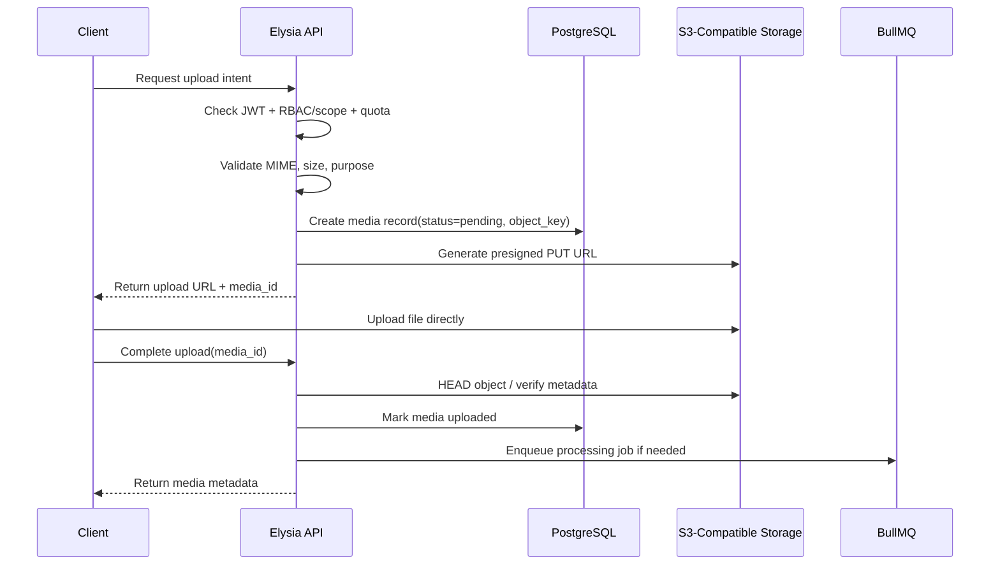

Download flow:

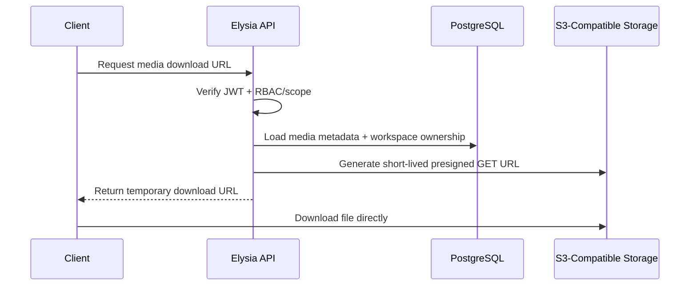

### 20.17 Webhooks

Inbound provider webhooks follow a receive-fast, process-async pattern.

Rules:
- Read raw body before JSON parsing.
- Verify HMAC signatures over raw bytes when the provider supports signatures.
- Use timing-safe comparison for signatures and API keys.
- Apply IP allowlists only when the provider publishes stable ranges.
- Apply timestamp replay protection when the provider supplies a trusted timestamp.
- Store provider event IDs for idempotency.
- Persist raw event metadata, enqueue BullMQ job, and return quickly.
- Hide inbound webhook routes from consumer OpenAPI specs.

Inbound webhook flow:

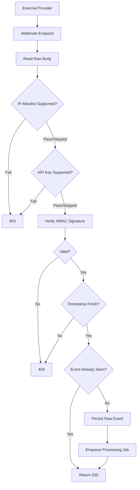

Public API projects that emit customer webhooks must also implement outbound webhook delivery.

Outbound webhook rules:
- Maintain an event catalog.
- Customers register endpoints and event subscriptions.
- Sign every payload with a per-endpoint secret.
- Store delivery attempts and responses.
- Retry with exponential backoff.
- Dead-letter terminal failures.
- Provide a replay mechanism.

Outbound webhook flow:

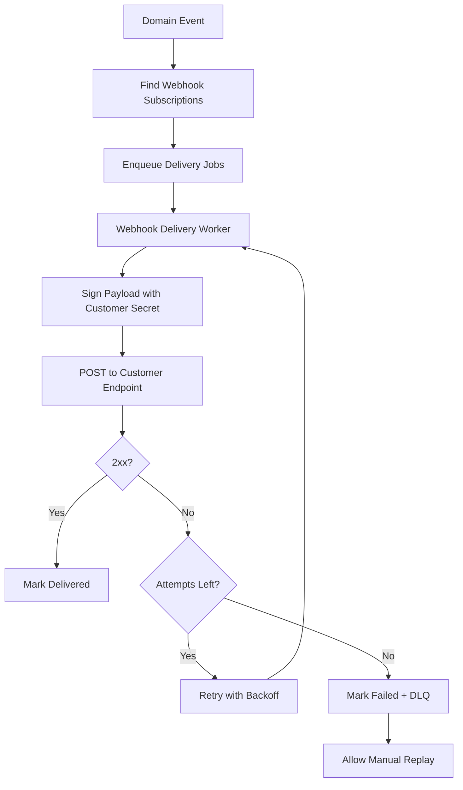

### 20.18 Telemetry And Observability

OpenTelemetry is mandatory for API and worker processes.

Telemetry layers:

| Layer | Standard | Purpose |
|---|---|---|
| Logs | Pino JSON | Operational debugging and searchable request/job logs |
| Traces | OpenTelemetry | Request, job, DB, Redis, storage, and provider timing |
| Metrics | OpenTelemetry/Prometheus | Health, throughput, latency, failures, queue depth |
| Audit logs | PostgreSQL | Security and business accountability |

Rules:
- Start telemetry before route and worker registration.
- Flush telemetry on graceful shutdown.
- Propagate trace context into BullMQ jobs.
- Include `trace_id`, `span_id`, and `request_id` in logs.
- Do not record PII, tokens, secrets, full request bodies, or high-cardinality IDs in spans or metric labels.
- Health endpoints should be excluded from noisy traces where practical.

Telemetry flow:

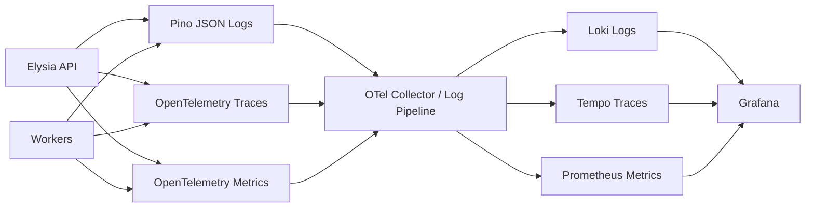

Required metrics include:
- `http_requests_total`
- `http_request_duration_seconds`
- `http_errors_total`
- `auth_failures_total`
- `rbac_denials_total`
- `rate_limit_denials_total`
- `db_query_duration_seconds`
- `redis_command_duration_seconds`
- `bullmq_jobs_enqueued_total`
- `bullmq_jobs_completed_total`
- `bullmq_jobs_failed_total`
- `webhook_events_failed_total`
- `media_upload_completed_total`
- `push_notifications_failed_total`

Allowed metric labels:
- `service`
- `env`
- `route`
- `method`
- `status_code`
- `job_name`
- `provider`
- `error_code`
- `api_profile`

Banned metric labels:
- `user_id`
- `email`
- `phone`
- `workspace_id`
- `request_id`
- `resource_id`
- raw path values containing IDs

### 20.19 Logging: Pino

Pino is the mandatory logger.

Rules:
- Production logs are structured JSON.
- Local development may use pretty logs.
- Never log PII, bearer tokens, refresh tokens, API keys, cookies, card data, or raw request bodies by default.
- Redact `Authorization`, `Cookie`, `Set-Cookie`, API key headers, and provider secrets.
- Every request log includes `request_id`, `trace_id`, `method`, `route`, `status`, and `duration_ms`.
- Worker logs include `job_id`, `job_name`, `attempt`, `trace_id`, and safe error codes.

### 20.20 Audit Log

Audit logs are mandatory and live in PostgreSQL. They are product/security records, not disposable telemetry.

Recommended fields:

```text
id
workspace_id
actor_type: user | machine | system
actor_id
action
resource_type
resource_id
result: allowed | denied | success | failure
ip
user_agent
request_id
metadata
created_at
```

Mandatory audit events:
- login/logout/session refresh
- token refresh failure and suspicious auth events
- RBAC role or permission changes
- member invites, removals, and role changes
- API client/key creation, rotation, and revocation
- media upload intent, upload completion, download URL issuance, and deletion
- destructive actions
- billing/payment-sensitive actions
- public API auth failures and rate limit denials

### 20.21 Health, Readiness, Metrics, And Admin Endpoints

Every backend exposes:

| Endpoint | Purpose | Auth |
|---|---|---|
| `GET /health` | Liveness, process responds | Public to Nginx/load balancer |
| `GET /ready` | Dependency readiness | Internal/Nginx/load balancer |
| `GET /metrics` | Prometheus scrape if used | Internal only |
| `GET /docs` | Scalar docs | Dev/staging or auth-gated |
| `GET /.well-known/jwks.json` | Public JWT verification keys | Public |

Rules:
- `/health` must not check dependencies.
- `/ready` checks PostgreSQL, Redis, and any mandatory storage dependency.
- Health/readiness responses must not expose secrets, internal hostnames, image tags, dependency credentials, or detailed config.
- `/ready` returns 503 during graceful shutdown.

#### 20.21.1 Timeouts, Body Limits, And Abort Handling

Every backend API must define explicit limits. Unbounded parsing, unbounded provider calls, and unbounded database waits are banned.

Baseline limits:

| Limit | Default |
|---|---:|
| JSON body size | `1mb` unless endpoint requires more |
| Form body size | `1mb` unless endpoint requires more |
| Direct binary upload to API | banned by default |
| Presigned upload object size | product-specific, enforced before issuing intent |
| HTTP request handling timeout | `30s` maximum for normal endpoints |
| Database query timeout | `10s` default |
| Database transaction timeout | `20s` default for HTTP handlers |
| External provider call timeout | `5s` default unless provider requires longer |
| Webhook synchronous handling timeout | `5s`; long work is queued |
| Queue job timeout | job-specific and documented |

Rules:
- Reject oversized requests before business logic runs.
- Return `413 PAYLOAD_TOO_LARGE` when body or declared upload size exceeds the endpoint limit.
- Use object-storage presigned uploads for media and large files; do not stream large blobs through the API container by default.
- Long-running work moves to BullMQ and returns an accepted/in-progress response.
- Every external provider call uses a timeout and cancellation path.
- Propagate `AbortSignal` or equivalent cancellation from request lifecycle into fetch/provider/database helpers where supported.
- Do not swallow timeout errors; map them to safe error codes and log with request/trace IDs.
- Timeouts must be shorter than graceful shutdown drain windows so cleanup can complete before Docker sends `SIGKILL`.
- Use pagination and server-side limits instead of allowing unbounded list/export requests.
- Expensive exports must run as jobs and expose progress/status endpoints.

### 20.22 Graceful Shutdown

Bun receives `SIGTERM` from Docker on container stop. API and worker processes must drain cleanly.

Shutdown order is mandatory:

1. Set `isShuttingDown = true`.
2. `/ready` returns `503` immediately.
3. Stop accepting new HTTP requests.
4. Drain in-flight HTTP handlers until timeout.
5. Reject new job enqueue attempts unless explicitly shutdown-safe.
6. Stop BullMQ workers from taking new jobs.
7. Let active jobs finish until worker drain timeout.
8. Ensure active DB transactions finish, commit, or rollback.
9. Close Drizzle/Bun SQL pool.
10. Close BullMQ queues, workers, and schedulers.
11. Close Redis connections.
12. Flush logs and OpenTelemetry exporters.
13. Exit with code `0` only after cleanup succeeds or the timeout policy has been applied.

Rules:
- Do not call `process.exit()` before async cleanup has completed or timed out.
- Do not start new HTTP work, jobs, or DB transactions after `isShuttingDown` is true.
- Mark readiness unavailable before closing database, Redis, queue, or telemetry connections.
- Close the SQL pool only after in-flight HTTP handlers and active worker jobs are drained or timed out.
- Flush OpenTelemetry after the final shutdown logs/spans have been emitted.
- Docker Compose `stop_grace_period` for `api` must be at least `30s`.
- Docker Compose `stop_grace_period` for `worker` must be at least `60s`; media/import-heavy products may require longer.
- `docker compose down` is not zero-downtime. It is a full environment stop; the goal is clean rollback/closure, not serving availability.

Database transaction rules:
- All service transactions must use scoped transaction callbacks/helpers.
- Do not store transaction handles in module-level or global state.
- Do not pass transaction handles into background jobs, event emitters, timers, or async work that can outlive the request/job handler.
- If shutdown starts while a request/job transaction is active, let the handler finish within the drain timeout.
- If an exception or timeout occurs inside a transaction, rollback is mandatory.
- Long-running transactions are banned in HTTP request handlers; move long work to BullMQ jobs with checkpoints.

BullMQ worker shutdown rules:
- Workers stop taking new jobs on `SIGTERM`.
- Active jobs may finish within `WORKER_SHUTDOWN_TIMEOUT_MS`.
- Jobs must be idempotent because Docker sends `SIGKILL` after `stop_grace_period` expires.
- Long jobs must checkpoint progress so retry is safe after process termination.
- Close workers before closing shared Redis connections.

Recommended shutdown environment variables:

```env
SHUTDOWN_GRACE_MS=30000
HTTP_DRAIN_TIMEOUT_MS=25000
WORKER_SHUTDOWN_TIMEOUT_MS=60000
DB_QUERY_TIMEOUT_MS=10000
DB_TRANSACTION_TIMEOUT_MS=20000
OTEL_SHUTDOWN_TIMEOUT_MS=5000
```

Reference Elysia shutdown implementation:

```typescript
import { Elysia } from 'elysia'
import { sql } from './lib/db'
import { redis } from './lib/redis'
import { logger } from './lib/logger'
import { shutdownTelemetry } from './lib/telemetry'
import { closeQueues, closeWorkers } from './jobs/queues'

let isShuttingDown = false

function withTimeout<T>(promise: Promise<T>, ms: number, label: string) {
  return Promise.race([
    promise,
    new Promise<never>((_, reject) => {
      setTimeout(() => reject(new Error(`${label} timed out after ${ms}ms`)), ms)
    })
  ])
}

export const app = new Elysia()
  .get('/health', () => ({ status: 'ok' }))
  .get('/ready', async ({ status }) => {
    if (isShuttingDown) {
      return status(503, { status: 'shutting_down' })
    }

    // Keep readiness checks lightweight. Do not run business logic here.
    await sql`select 1`
    await redis.ping()

    return { status: 'ready' }
  })
  .onBeforeHandle(({ status }) => {
    if (isShuttingDown) {
      return status(503, {
        success: false,
        error: {
          code: 'SERVICE_SHUTTING_DOWN',
          message: 'Service is shutting down. Please retry shortly.'
        }
      })
    }
  })

const server = app.listen(Number(process.env.PORT ?? 3000))

async function shutdown(signal: NodeJS.Signals) {
  if (isShuttingDown) return
  isShuttingDown = true

  logger.info({ signal }, 'shutdown started')

  try {
    await withTimeout(
      Promise.resolve(server.stop(true)),
      Number(process.env.HTTP_DRAIN_TIMEOUT_MS ?? 25_000),
      'http drain'
    )

    await withTimeout(
      closeWorkers(),
      Number(process.env.WORKER_SHUTDOWN_TIMEOUT_MS ?? 60_000),
      'worker shutdown'
    )

    await closeQueues()

    // Close DB after request handlers and workers are drained.
    await sql.end()
    await redis.quit()

    await withTimeout(
      shutdownTelemetry(),
      Number(process.env.OTEL_SHUTDOWN_TIMEOUT_MS ?? 5_000),
      'telemetry shutdown'
    )

    logger.info('shutdown completed')
    process.exit(0)
  } catch (error) {
    logger.error({ error }, 'shutdown failed')
    process.exit(1)
  }
}

process.once('SIGTERM', shutdown)
process.once('SIGINT', shutdown)
```

Reference transaction helper:

```typescript
import { db } from '../lib/db'
import { isShuttingDown } from '../lib/shutdown'
import { AppError } from '../lib/errors'

export async function runInTransaction<T>(
  fn: Parameters<typeof db.transaction<T>>[0]
) {
  if (isShuttingDown()) {
    throw new AppError('SERVICE_SHUTTING_DOWN', 'Service is shutting down')
  }

  return db.transaction(async (tx) => {
    // Never leak tx outside this callback. Drizzle commits on successful
    // return and rolls back when this callback throws.
    return fn(tx)
  })
}
```

Reference BullMQ worker shutdown:

```typescript
import { Queue, Worker } from 'bullmq'
import { redisConnection } from '../lib/redis'

export const mediaQueue = new Queue('media', {
  connection: redisConnection
})

export const mediaWorker = new Worker(
  'media',
  async (job) => {
    // Job handlers must be idempotent and safe to retry. Use DB status and
    // checkpoints before doing external side effects.
    return processMediaJob(job.data)
  },
  {
    connection: redisConnection,
    concurrency: Number(process.env.MEDIA_WORKER_CONCURRENCY ?? 5)
  }
)

export async function closeWorkers() {
  // Worker.close() stops taking new jobs and waits for active jobs.
  await mediaWorker.close()
}

export async function closeQueues() {
  await mediaQueue.close()
}
```

### 20.23 Testing And CI

Required backend checks:
- `bun install --frozen-lockfile`
- formatting check
- lint
- TypeScript typecheck
- unit tests for services and pure utilities
- integration tests with PostgreSQL and Redis
- OpenAPI generation/drift check
- Drizzle migration check
- Docker build
- Docker image API command smoke test
- Docker image worker command smoke test
- auth/JWT/JWKS tests
- CORS and cookie/CSRF policy tests when browser clients use cookies
- RBAC and scope authorization tests
- multi-tenant isolation tests
- idempotency tests
- rate limit policy tests
- cache invalidation tests for permissions and high-risk cached reads
- timeout/body-size tests for large and slow requests
- media upload/download flow tests
- webhook signature and replay tests
- worker retry/failure tests
- queue retry, backoff, DLQ, and manual replay tests

### 20.24 Deployment: Docker Compose + Nginx On VPS

Backend production deployments use Docker Compose on VPS behind Nginx.

Baseline services:

```text
nginx
api
worker
postgres
pgbouncer
redis
otel-collector
prometheus
loki
tempo
grafana
certbot
```

Optional project services:

```text
minio
mailpit
bull-board
```

Deployment topology:

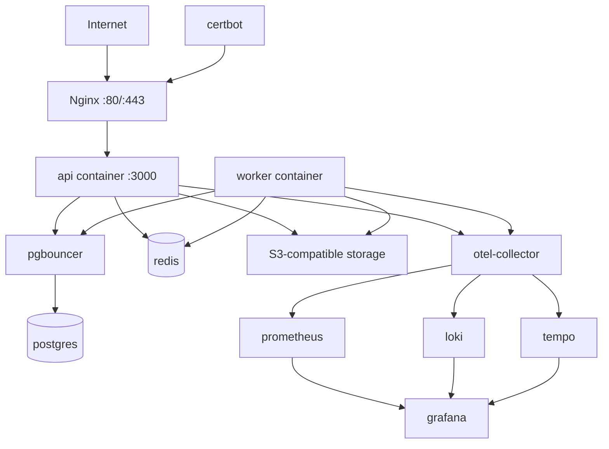

#### 20.24.1 Dockerfile Standard

Backend projects use one Bun application image for both the API process and worker process. Docker Compose changes runtime behavior through the container command.

Rules:
- Use `oven/bun:<pinned-version>` as the base image. Do not use `latest`.
- Build one application image, for example `example-api:${TAG}`.
- The `api` service uses the image default command.
- The `worker` service uses the same image with `command: ["bun", "run", "worker"]`.
- Do not create separate API and worker images unless the project has a documented size, security, or dependency-isolation reason.
- Runtime containers run as a non-root user.
- The application image exposes only the internal API port, usually `3000`.
- The application image must not publish host ports; host binding belongs to Nginx only.
- Do not bake secrets into Docker images through `ARG`, `ENV`, copied `.env` files, generated config, or build logs.
- Do not copy `.git`, local caches, test reports, coverage, Playwright artifacts, `.env*`, or source maps into production images unless explicitly approved.
- Require `bun.lock` and install with `bun install --frozen-lockfile`.

Recommended multi-stage Dockerfile:

```dockerfile
FROM oven/bun:<pinned-version> AS deps
WORKDIR /app
COPY package.json bun.lock ./
RUN bun install --frozen-lockfile

FROM oven/bun:<pinned-version> AS build
WORKDIR /app
COPY --from=deps /app/node_modules ./node_modules
COPY . .
RUN bun run typecheck
RUN bun run build

FROM oven/bun:<pinned-version> AS runtime
WORKDIR /app
ENV NODE_ENV=production

COPY package.json bun.lock ./
RUN bun install --frozen-lockfile --production
COPY --from=build /app/dist ./dist

USER bun
EXPOSE 3000
CMD ["bun", "run", "start"]
```

Recommended Compose usage:

```yaml
services:
  api:
    image: example-api:${TAG}
    expose:
      - "3000"
    stop_grace_period: 30s

  worker:
    image: example-api:${TAG}
    command: ["bun", "run", "worker"]
    stop_grace_period: 60s
```

Required `.dockerignore` baseline:

```text
.env
.env.*
.git
node_modules
.venv
coverage
test-results
playwright-report
.cache
.turbo
.DS_Store
```

Project-specific `.dockerignore` rules:
- Exclude raw documentation, wiki exports, screenshots, local data dumps, and generated artifacts that are not required at runtime.
- Keep migration files if production migration execution depends on the image.
- Keep OpenAPI generation inputs only when runtime docs or CI jobs need them.
- Never exclude files needed by `bun run build`, runtime startup, migrations, or worker execution.

Image verification:
- CI builds the Docker image.
- CI runs a smoke test for the API command.
- CI runs a smoke test for the worker command.
- CI verifies the image starts without secrets baked into the image.

### 20.25 Environment Variables

`.env.example` is the source of truth for required runtime configuration.

Categories:

```text
APP
HTTP
DATABASE
REDIS
JWT
CORS
RBAC
RATE_LIMIT
STORAGE
QUEUE
TELEMETRY
LOGGING
PUSH
EMAIL
WEBHOOK
VAULT
```

Rules:
- Local development uses `.env`.
- Staging and production use Vault or the approved secrets manager.
- Never bake secrets into Docker images.
- Every new env var is added to `.env.example`.
- JWT private keys and refresh token secrets are secrets, not config.

### 20.26 Backup, Retention, And Recovery

Rules:
- PostgreSQL backups are mandatory.
- Object storage backup/versioning policy is mandatory.
- Redis is not a source of truth unless an ADR explicitly says otherwise.
- Restore drill is required before production launch.
- Audit log retention is defined per product.
- Telemetry retention is defined per environment.
- Media deletion lifecycle must define soft delete, physical delete, and recovery windows.

### 20.27 Standard Directory Layout

```text
src/
  index.ts
  app.ts
  controllers/
    auth.controller.ts
    workspace.controller.ts
    health.controller.ts
    media.controller.ts
    webhook.controller.ts
  services/
    auth.service.ts
    rbac.service.ts
    workspace.service.ts
    media.service.ts
    webhook.service.ts
  db/
    schema.ts
    migrations/
  jobs/
    queues.ts
    workers/
      webhook.worker.ts
      media.worker.ts
      notification.worker.ts
  lib/
    env.ts
    db.ts
    redis.ts
    logger.ts
    telemetry.ts
    errors.ts
    response.ts
    jwt.ts
    jwks.ts
    rbac.ts
    rate-limit.ts
    idempotency.ts
    storage.ts
    webhook-verify.ts
  types/
    api.ts
    errors.ts
    auth.ts
  utils/
    pagination.ts
    cursor.ts
tests/
  integration/
  e2e/
Dockerfile
docker-compose.yml
.env.example
```

Rules:
- Controllers own HTTP routing, route schemas, auth guards, OpenAPI metadata, and response mapping.
- Services own business logic, transactions, authorization-adjacent domain rules, and orchestration.
- Workers call services and never duplicate controller logic.
- `lib/` owns cross-cutting infrastructure and reusable adapters.
- Generated OpenAPI client code does not live in the backend repo unless a project explicitly generates SDK artifacts.

### 20.28 Anti-Patterns

The following are banned:

| Anti-pattern | Alternative |
|---|---|
| Eden Treaty as the official dashboard/mobile/public API contract | OpenAPI 3.1 + generated clients |
| `HS256` for production SaaS/public API JWTs | Asymmetric `jose` signing with JWK/JWKS and `kid` |
| JWT authorization without RBAC/scope checks | JWT identity + workspace membership + RBAC/scopes + resource ownership |
| Global roles without workspace context | Tenant-scoped memberships and roles |
| Missing `workspace_id` filters on tenant-owned queries | Mandatory tenant-scoped service queries |
| Returning raw Elysia/Zod/SQL errors | Standard error envelope with safe codes |
| Storing blob files or base64 in PostgreSQL | S3-compatible object storage + DB metadata/object keys |
| Public-read storage buckets by default | Private bucket + presigned URLs |
| Processing uploads synchronously in HTTP request | BullMQ worker processing |
| Redis as source of truth for durable business data | PostgreSQL source of truth, Redis cache/queue only |
| Missing idempotency for unsafe public writes | `Idempotency-Key` with request hash and stored result |
| Blocking HTTP response on email/push/provider call | Enqueue BullMQ job and respond promptly |
| Webhook JSON parse before signature verification | Verify raw body first |
| Missing telemetry in API or worker | OpenTelemetry from day one |
| High-cardinality metric labels | Low-cardinality route/status/job/provider labels |
| Logging tokens, cookies, API keys, request bodies, or PII | Redacted structured logs |
| Exposing API container ports to the host | Nginx is the only host-facing service |
| Running workers inside the API process | Separate worker process/container |
| Manual DB schema changes | Drizzle migrations |
| Using `oven/bun:latest` | Pinned Bun image version |
| Separate API and worker images without a concrete reason | One application image with different Compose commands |
| Running production containers as root | Non-root runtime user |
| Baking secrets into Docker images | Runtime environment injection through Vault or approved secrets manager |
| Retrying permanent provider or validation errors | Classify transient vs terminal failures before retrying |
| Bulk jobs starving critical queues | Separate queues, priorities, and concurrency limits |
| Infinite retries or unbounded backoff | Bounded attempts, capped exponential backoff, DLQ, and alerting |

---

## 21. Open Questions

All current architectural decisions for the baseline backend stack are resolved. Product-specific choices such as exact push provider, storage provider, API deprecation window, and retention periods must be documented per project.
