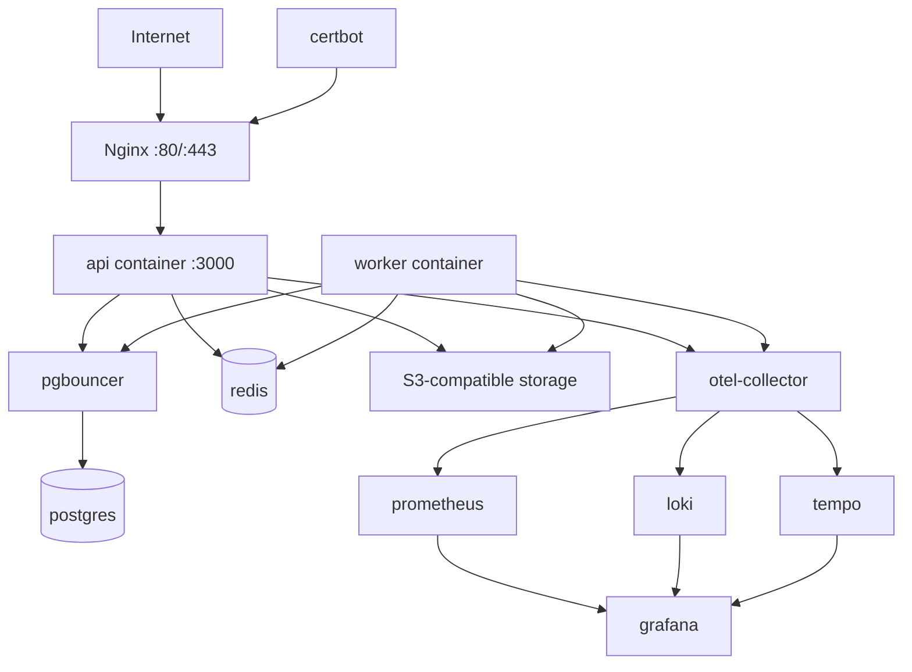
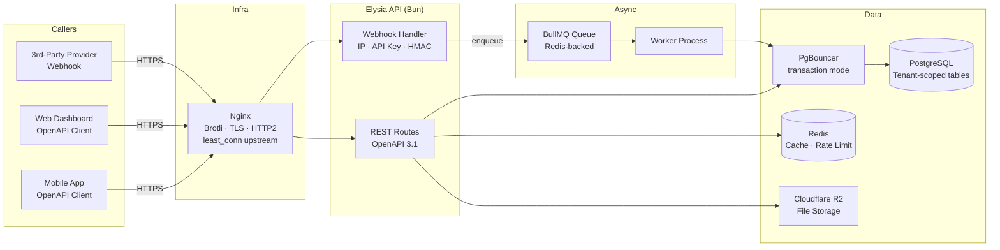
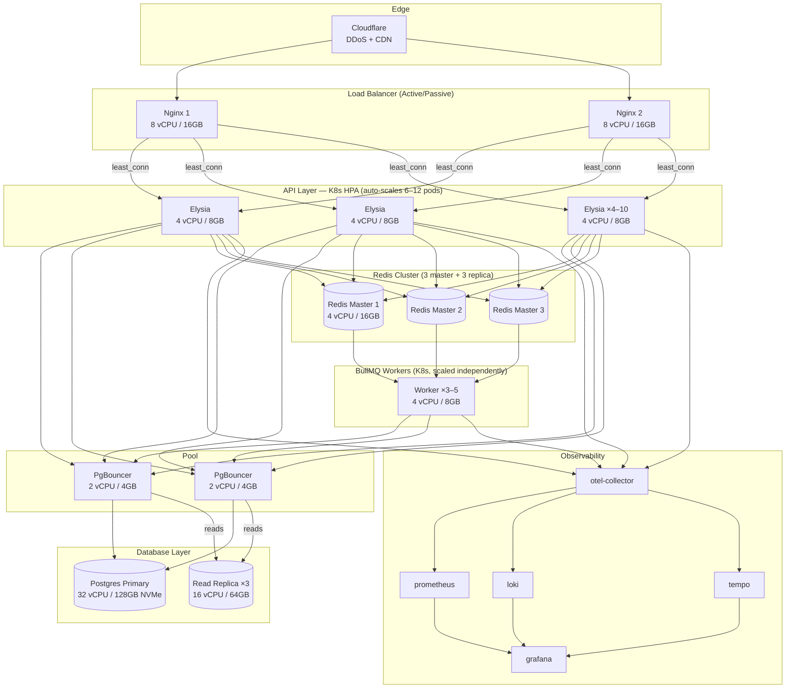

# Infrastructure Stack: Docker Compose + Nginx

Source URL: Internal draft
Collected: 2026-04-15
Published: 2026-04-15
Status: Draft
Scope: Docker Compose, Nginx, Vault, deploy, scalability tiers, and Kubernetes upgrade path

---

## 14. Environment & Secrets

### 14.1 Secrets by environment

Secrets management is tiered by environment:

| Environment | Secrets source | Mechanism |
|---|---|---|
| Local development | `.env` file | `env_file` in Docker Compose |
| Staging | HashiCorp Vault | Injected at container startup via Vault Agent or CI pipeline |
| Production | HashiCorp Vault | Injected at container startup via Vault Agent or CI pipeline |

**Never hardcode secrets, API keys, DSNs, or database URLs in source code.**
**Never bake secrets into Docker images** via `ENV` instructions or build-time `ARG` values.

### 14.2 HashiCorp Vault (staging & production)

**HashiCorp Vault OSS (self-hosted)** is the mandatory secrets manager for staging and production environments. We run the open-source edition in a Docker container on our own infrastructure — zero licensing cost beyond the server we already operate.

**Deployment model:**
- Vault runs as a Docker container, added to the product's infrastructure Docker Compose (or a shared ops Compose stack).
- Storage backend: **PostgreSQL** (reuses the existing database cluster — no additional infrastructure needed).
- Single-node for now. High-availability can be added when the team scales.
- Vault is initialized once and unsealed via auto-unseal (using a cloud KMS key) or a manually stored unseal key held by the designated architecture owner.

Rules:
- Secrets are organized by product and environment: `secret/<product>/<env>/<key>` (e.g., `secret/mini-blast/production/DATABASE_URL`).
- Applications retrieve secrets at startup via the **Vault Agent sidecar** or the **Vault API** (using a short-lived token). Secrets are injected as environment variables, not mounted as files.
- Vault tokens used by the application are short-lived (TTL ≤ 1 hour) and renewed automatically by the Vault Agent. Never use a root or long-lived token in application code.
- Secret rotation is handled in Vault. Application code must not assume a secret is static — it may change between restarts.
- Access policies follow least-privilege: each product's service account can read only its own secrets.
- Vault access credentials for the CI pipeline are stored as **GitHub Actions Secrets** (this is the one permitted use of Actions Secrets for non-trivial values).

### 14.3 `.env` file conventions (local development only)

| File | Purpose |
|---|---|
| `.env` | Local development values (never committed) |
| `.env.example` | Template with all required keys, empty values (committed, kept up to date) |
| `.env.test` | Values for the test environment (committed only if non-sensitive) |

`.env` is in `.gitignore`. The `.env.example` is the source of truth for what variables exist — every new secret added to Vault must also be added (with an empty value) to `.env.example`.

### 14.4 Required environment variables (baseline)

Every product must define at minimum:

```env
# App
APP_ENV=development          # development | staging | production
APP_URL=http://localhost:3000

# Database
# Staging/production DATABASE_URL points to PgBouncer, not directly to Postgres.
DATABASE_URL=postgresql://...

# Auth (JWT / JOSE)
JWT_ISSUER=http://localhost:3000
JWT_AUDIENCE=example-api
JWT_ACTIVE_KID=local-dev-key
JWT_PRIVATE_JWK=...
JWT_PUBLIC_JWKS=...

# CORS
CORS_ALLOWED_ORIGINS=http://localhost:5173

# Redis / BullMQ
REDIS_URL=redis://localhost:6379

# Storage
STORAGE_ENDPOINT=http://localhost:9000
STORAGE_BUCKET=example-local-media
STORAGE_ACCESS_KEY=...
STORAGE_SECRET_KEY=...

# Telemetry
OTEL_SERVICE_NAME=example-api
OTEL_EXPORTER_OTLP_ENDPOINT=http://otel-collector:4318
OTEL_TRACES_EXPORTER=otlp
OTEL_METRICS_EXPORTER=otlp

# Monitoring (optional)
SENTRY_ENABLED=false
SENTRY_DSN=
```

---

## 19. Nginx — Reverse Proxy & Compression

Nginx sits in front of every deployed HTTP surface adopting this standard. For backend APIs, it is the single point of entry for TLS termination, compression, baseline security headers, coarse IP rate limiting, request-size limits, and upstream load balancing.

Nginx is not optional. It is the required outside-facing gateway for every deployed application process adopting this stack. Backend services or other application processes must never be directly reachable from outside the Docker network in staging or production.

### 19.1 Placement in Docker Compose

Every deployed backend API runtime service's `docker-compose.yml` includes a dedicated Nginx service that proxies to the API container. The API container exposes its port **only internally** (via `expose:`, not `ports:`). Nginx is the only service bound to the host.

This reverse-proxy shape is for backend APIs and approved runtime application processes. Static Vite dashboard deployments do not use this proxy-to-app shape; they serve `dist/` directly from Nginx as defined in `2026-05-22-web-react-vite-dashboard-stack.md`.

The deployment artifact must include both:
- an API image, usually based on `oven/bun`, running the backend service or another approved runtime process;
- an Nginx gateway image, based on the approved Nginx+Brotli image, bound to host ports.

The API image must not publish host ports. Direct outside access to the API process bypasses security headers, Brotli/Gzip compression, coarse edge rate limiting, request-size limits, and upstream retry behavior.

```
[Client] → [Nginx :80/:443] → [API container :3000]
                            → [PgBouncer :5432] → [Postgres]
                            → [Redis :6379]
```

Required Compose shape:

```yaml
services:
  api:
    image: example-api:${TAG}
    expose:
      - "3000"
    stop_grace_period: 30s
    security_opt:
      - no-new-privileges:true
    cap_drop:
      - ALL
    environment:
      APP_ENV: production
    depends_on:
      - pgbouncer
      - redis

  worker:
    image: example-api:${TAG}
    command: ["bun", "run", "worker"]
    stop_grace_period: 60s
    security_opt:
      - no-new-privileges:true
    cap_drop:
      - ALL
    environment:
      APP_ENV: production
    depends_on:
      - pgbouncer
      - redis

  nginx:
    image: example-api-nginx:${TAG}
    ports:
      - "80:80"
      - "443:443"
    environment:
      NGINX_UPSTREAM_HOST: api
      NGINX_UPSTREAM_PORT: 3000
    depends_on:
      - api
```

### 19.1.1 Backend API + Worker + Observability Profile

Standalone Bun + Elysia backend APIs use a runtime-service deployment profile with separate API and worker processes.

Baseline services:

```text
nginx
api
worker
postgres
pgbouncer
redis
otel-collector
prometheus
loki
tempo
grafana
certbot
```

Optional project services:

```text
minio
mailpit
bull-board
```

Rules:
- `api` and `worker` use the same application image but different commands.
- `api` handles HTTP traffic only.
- `worker` processes BullMQ jobs only.
- Do not run BullMQ workers inside the API process in production.
- `api` and `worker` both connect to PgBouncer, Redis, object storage, and OpenTelemetry Collector.
- Redis is mandatory for BullMQ, rate limiting, permission cache, and short-lived coordination.
- PgBouncer runs in transaction mode.
- `api` and `worker` use separate `stop_grace_period` values because HTTP drain and job drain have different timing needs.
- `api` `stop_grace_period` must be at least `30s`.
- `worker` `stop_grace_period` must be at least `60s`; media/import-heavy projects may require longer.
- Production media storage should prefer managed S3-compatible storage such as Cloudflare R2 or AWS S3. Self-hosted MinIO in production requires documented backup, retention, and restore procedures.
- Grafana stack is the default self-hosted observability profile on VPS.

Deployment topology:



### 19.2 Docker image: Nginx + Brotli

The standard Nginx Docker image does not include Brotli. Use **`fholzer/nginx-brotli`** as the base image — it ships the `ngx_brotli` module pre-compiled against the latest stable Nginx.

For static SPA dashboard deployments, use `fholzer/nginx-brotli:<pinned-version>` directly in the dashboard runtime stage. Do not create a separate `nginx/Dockerfile` and do not install Certbot into the dashboard image.

Runtime services that proxy to an API container maintain a minimal `nginx/` directory:

```
nginx/
  Dockerfile            — extends fholzer/nginx-brotli, copies entrypoint
  nginx.conf.template   — full Nginx config with ${VARIABLE} placeholders
  entrypoint.sh         — runs envsubst then exec nginx
```

`nginx/Dockerfile`:
```dockerfile
FROM fholzer/nginx-brotli:<pinned-version>
COPY nginx.conf.template /etc/nginx/nginx.conf.template
COPY entrypoint.sh /entrypoint.sh
RUN chmod +x /entrypoint.sh
ENTRYPOINT ["/entrypoint.sh"]
```

`nginx/entrypoint.sh`:
```sh
#!/bin/sh
set -e
envsubst '${NGINX_UPSTREAM_HOST} ${NGINX_UPSTREAM_PORT} ${NGINX_BROTLI_ENABLED}
           ${NGINX_GZIP_ENABLED} ${NGINX_WORKER_PROCESSES} ${NGINX_WORKER_CONNECTIONS}
           ${NGINX_KEEPALIVE_TIMEOUT} ${NGINX_CLIENT_MAX_BODY_SIZE}
           ${NGINX_RATE_LIMIT_RPS} ${NGINX_SSL_ENABLED}' \
  < /etc/nginx/nginx.conf.template > /etc/nginx/nginx.conf
exec nginx -g 'daemon off;'
```

### 19.2.1 Static SPA Dashboard Profile

Static Vite dashboard deployment is a specialized profile, not the generic reverse-proxy runtime-service profile above.

Source of truth: `2026-05-22-web-react-vite-dashboard-stack.md`.

Infra-level invariants:
- Dashboard production deployment must use Docker Compose.
- Dashboard production runtime must use Nginx serving Vite `dist/` directly from `/usr/share/nginx/html`.
- Dashboard runtime must not run Bun, Node, Vite, `vite preview`, a custom static server, or proxy to an internal dashboard app server.
- Dashboard production must terminate TLS at Nginx with Let's Encrypt certificates.
- Port 80 may only serve ACME HTTP-01 challenge files and HTTPS redirects.
- Certificates must live in Docker volumes, not image layers.
- Certificate issuance and renewal must be handled by a Certbot sidecar or approved equivalent renewal container.
- Nginx must reload after successful certificate renewal, and certificate expiry must be monitored.
- Static dashboard containers should use a read-only filesystem and drop unnecessary Linux capabilities where compatible.
- Dashboard runtime images must not include secrets, public source maps, source control metadata, local caches, test reports, coverage, Playwright artifacts, or dependency install caches.
- Static hashed assets must use immutable cache headers, while `index.html` must use no-cache or must-revalidate headers.

Do not copy the generic `nginx/Dockerfile`, upstream proxy, or rolling app-service deploy template into dashboard projects. Dashboard projects use the deployment contract defined in the dashboard stack draft.

### 19.2.2 Generic Runtime Service Nginx Template

The following Nginx template is for backend APIs and approved runtime services that proxy to an internal API container. It is not the dashboard static SPA template and does not include CSP nonce propagation, robots/sitemap handling, static asset caching, or SSR cache rules.

`nginx/nginx.conf.template`:
```nginx
load_module /usr/lib/nginx/modules/ngx_http_brotli_filter_module.so;
load_module /usr/lib/nginx/modules/ngx_http_brotli_static_module.so;

worker_processes ${NGINX_WORKER_PROCESSES};

events {
    worker_connections ${NGINX_WORKER_CONNECTIONS};
}

http {
    include       /etc/nginx/mime.types;
    default_type  application/octet-stream;

    map ${NGINX_SSL_ENABLED} $hsts_header {
        default "";
        on "max-age=31536000; includeSubDomains";
    }

    sendfile on;
    tcp_nopush on;
    tcp_nodelay on;
    keepalive_timeout ${NGINX_KEEPALIVE_TIMEOUT};
    server_tokens off;

    # Request body / upload limits. Backend APIs default to small JSON/form
    # payloads; large media uploads use presigned object-storage URLs.
    client_max_body_size ${NGINX_CLIENT_MAX_BODY_SIZE};

    # Coarse per-IP edge protection only. Product/user/workspace/API-client
    # limits are enforced inside the Elysia API with Redis-backed policies.
    limit_req_zone $binary_remote_addr zone=per_ip:10m rate=${NGINX_RATE_LIMIT_RPS}r/s;

    # Brotli: primary compression
    brotli ${NGINX_BROTLI_ENABLED};
    brotli_comp_level 5;
    brotli_static on;
    brotli_types
        text/plain
        text/css
        text/javascript
        application/javascript
        application/json
        application/xml
        application/rss+xml
        application/atom+xml
        image/svg+xml
        font/woff2;

    # Gzip: fallback for older clients
    gzip ${NGINX_GZIP_ENABLED};
    gzip_comp_level 5;
    gzip_min_length 1024;
    gzip_vary on;
    gzip_proxied any;
    gzip_types
        text/plain
        text/css
        text/javascript
        application/javascript
        application/json
        application/xml
        application/rss+xml
        application/atom+xml
        image/svg+xml;

    upstream api_backend {
        least_conn;
        server ${NGINX_UPSTREAM_HOST}:${NGINX_UPSTREAM_PORT};
        keepalive 64;
    }

    server {
        listen 80;
        server_name _;

        # Security headers are repeated in locations that set their own headers because
        # nginx does not inherit parent add_header directives in that case.
        add_header Strict-Transport-Security $hsts_header always;
        add_header X-Content-Type-Options "nosniff" always;
        add_header X-Frame-Options "DENY" always;
        add_header Referrer-Policy "strict-origin-when-cross-origin" always;
        add_header Permissions-Policy "camera=(), microphone=(), geolocation=()" always;
        add_header Cross-Origin-Opener-Policy "same-origin" always;

        location /health {
            add_header Strict-Transport-Security $hsts_header always;
            add_header X-Content-Type-Options "nosniff" always;
            add_header X-Frame-Options "DENY" always;
            add_header Referrer-Policy "strict-origin-when-cross-origin" always;
            add_header Permissions-Policy "camera=(), microphone=(), geolocation=()" always;
            add_header Cross-Origin-Opener-Policy "same-origin" always;
            proxy_http_version 1.1;
            proxy_set_header Host $host;
            proxy_pass http://api_backend/health;
        }

        location /ready {
            allow 127.0.0.1;
            allow 10.0.0.0/8;
            allow 172.16.0.0/12;
            allow 192.168.0.0/16;
            deny all;
            add_header Strict-Transport-Security $hsts_header always;
            add_header X-Content-Type-Options "nosniff" always;
            add_header X-Frame-Options "DENY" always;
            add_header Referrer-Policy "strict-origin-when-cross-origin" always;
            add_header Permissions-Policy "camera=(), microphone=(), geolocation=()" always;
            add_header Cross-Origin-Opener-Policy "same-origin" always;
            proxy_http_version 1.1;
            proxy_set_header Host $host;
            proxy_pass http://api_backend/ready;
        }

        location /metrics {
            allow 127.0.0.1;
            allow 10.0.0.0/8;
            allow 172.16.0.0/12;
            allow 192.168.0.0/16;
            deny all;
            proxy_http_version 1.1;
            proxy_set_header Host $host;
            proxy_pass http://api_backend/metrics;
        }

        location ~ ^/docs(/json)?$ {
            return 404;
        }

        location / {
            limit_req zone=per_ip burst=40 nodelay;

            proxy_http_version 1.1;
            proxy_set_header Host $host;
            proxy_set_header X-Real-IP $remote_addr;
            proxy_set_header X-Forwarded-For $proxy_add_x_forwarded_for;
            proxy_set_header X-Forwarded-Proto $scheme;
            proxy_set_header Connection "";

            proxy_next_upstream error timeout http_502 http_503 http_504;
            proxy_next_upstream_tries 2;
            proxy_connect_timeout 5s;
            proxy_send_timeout 30s;
            proxy_read_timeout 30s;

            add_header Strict-Transport-Security $hsts_header always;
            add_header X-Content-Type-Options "nosniff" always;
            add_header X-Frame-Options "DENY" always;
            add_header Referrer-Policy "strict-origin-when-cross-origin" always;
            add_header Permissions-Policy "camera=(), microphone=(), geolocation=()" always;
            add_header Cross-Origin-Opener-Policy "same-origin" always;
            proxy_pass http://api_backend;
        }
    }
}
```

Use this as the backend API baseline template. Products may extend it for TLS certificates, multiple upstreams, product-specific path rules, or additional response headers, but Brotli module loading, gzip fallback, upstream proxying, edge IP rate limiting, and baseline security headers must remain intact. Do not use `if` inside the `server` block for HSTS toggling; use a `map` at the `http` level and feed the result into `add_header`.

#### Default Nginx security template rules

The backend API Nginx security baseline is generalized for JSON APIs. Keep the default policy strict and small.

Rules:
- Backend API Nginx templates do not include CSP nonce handling by default.
- CSP belongs in the static dashboard Nginx template or in an approved web runtime template that actually serves HTML.
- Product-specific third-party domains are not added to the backend API template.
- Static asset caching rules do not belong in the backend API proxy template.
- `robots.txt`, `sitemap.xml`, SPA fallback, and SSR HTML cache rules belong in frontend/web runtime templates only.
- Every Nginx `location` block that defines any `add_header` must repeat the complete security header set, because Nginx does not inherit parent `add_header` directives in that case.
- If a backend endpoint returns private or user-specific data, application code must set `Cache-Control: no-store`.

#### Edge vs backend rate limiting

Nginx `limit_req` is a coarse per-IP abuse shield. It protects Bun from obvious traffic floods and should be simple enough to reason about during an incident.

The Elysia API remains the source of truth for product rate limits because only the application can identify users, workspaces, API clients, scopes, route groups, request cost, auth endpoints, upload intent endpoints, and webhook provider behavior.

Rules:
- Do not encode product plans, workspace quotas, user tiers, or API-client quotas in Nginx.
- Do not rely on Nginx rate limiting as the only limiter for public APIs.
- Keep Nginx limits broad enough to avoid blocking legitimate NAT-heavy customers.
- Return detailed `RateLimit-*` headers from the Elysia limiter, not from Nginx.
- Treat Nginx 429s as infrastructure protection events and Elysia 429s as product/API policy events.

### 19.3 Compression strategy

**Brotli is the primary compression algorithm.** Gzip is the fallback for clients that do not advertise `br` in their `Accept-Encoding` header.

| Algorithm | Compression vs Gzip | Browser support | Use when |
|---|---|---|---|
| **Brotli (`br`)** | ~15–25% smaller | All modern browsers | Default for all responses |
| **Gzip** | Baseline | Universal | Fallback when client does not support Brotli |
| Zstandard (`zstd`) | Comparable to Brotli, faster | Chrome 118+, Firefox 128+ | Revisit in 2027 when support is universal |

Compression applies to: `text/html`, `text/css`, `text/javascript`, `application/json`, `application/javascript`, `image/svg+xml`, `font/woff2`.

Do **not** compress: already-compressed formats (`image/jpeg`, `image/png`, `image/webp`, `image/avif`, `video/*`, `audio/*`, `.gz`, `.zip`).

### 19.4 Runtime-configurable environment variables

All Nginx tuning parameters are injected via environment variables at container startup through `envsubst`. This makes every deployment environment independently configurable without rebuilding the image.

| Variable | Default | Purpose |
|---|---|---|
| `NGINX_UPSTREAM_HOST` | `api` | Docker Compose service name of the API container |
| `NGINX_UPSTREAM_PORT` | `3000` | Port the API container listens on |
| `NGINX_BROTLI_ENABLED` | `on` | Enable/disable Brotli compression (`on` / `off`) |
| `NGINX_GZIP_ENABLED` | `on` | Enable/disable Gzip fallback (`on` / `off`) |
| `NGINX_WORKER_PROCESSES` | `auto` | Nginx worker count (matches CPU cores when `auto`) |
| `NGINX_WORKER_CONNECTIONS` | `1024` | Max simultaneous connections per worker |
| `NGINX_KEEPALIVE_TIMEOUT` | `65` | Keep-alive timeout in seconds |
| `NGINX_CLIENT_MAX_BODY_SIZE` | `1m` | Max backend API request body size; media uses presigned object-storage uploads |
| `NGINX_RATE_LIMIT_RPS` | `20` | Requests per second per IP before 429 |
| `NGINX_SSL_ENABLED` | `off` | Enable TLS termination at Nginx (`on` in production) |

All variables have sensible defaults. Local development requires only `NGINX_UPSTREAM_HOST` and `NGINX_UPSTREAM_PORT` in `.env`.

### 19.5 Security headers at Nginx level

Baseline shared security headers are applied at the Nginx level. Backend API proxy templates do not own frontend CSP nonce handling because they do not serve HTML.

The `nginx.conf.template` adds these headers on every response:

```nginx
add_header Strict-Transport-Security $hsts_header always;
add_header X-Content-Type-Options "nosniff" always;
add_header X-Frame-Options "DENY" always;
add_header Referrer-Policy "strict-origin-when-cross-origin" always;
add_header Permissions-Policy "camera=(), microphone=(), geolocation=()" always;
add_header Cross-Origin-Opener-Policy "same-origin" always;
```

Important Nginx behavior: if a `location` block defines any `add_header`, it stops inheriting parent `add_header` directives. Any location that sets caching or other custom headers must repeat the complete security header set.

### 19.6 Static asset caching

Static asset caching is a frontend/web-runtime concern, not a backend API proxy concern. For static Vite dashboard deployments, use the caching rules in `2026-05-22-web-react-vite-dashboard-stack.md`.

Backend API responses that contain private, transactional, or user-specific data must opt into `Cache-Control: no-store` at the application layer. Public cacheable API responses require explicit product review and must include correct authorization and tenant-isolation guarantees.

### 19.7 Upstream load balancing

When multiple API instances are running (e.g., two replicas in Docker Compose), Nginx distributes traffic via `least_conn` (routes to the instance with the fewest active connections, which is better than round-robin for variable-length requests).

```nginx
upstream api_backend {
    least_conn;
    server ${NGINX_UPSTREAM_HOST}:${NGINX_UPSTREAM_PORT};
    # add more servers here for horizontal scaling
    keepalive 64;  # persistent connections to upstream
}
```

`keepalive 64` keeps 64 persistent connections open to each upstream, eliminating TCP handshake overhead for the majority of requests at 2K+ concurrent load.

---

## 20. Backend API Infrastructure and Scale Sections

### 20.11 Zero-Downtime Deployment (Docker Compose)

Zero-downtime deployment is **mandatory** for all services adopting this standard. Every deploy — no matter how small — must complete without dropping a single in-flight request.

#### Why zero-downtime is not automatic

The core problem is a **race condition** between three independent systems:

```
Pod receives SIGTERM
      │
      ├── App starts draining (stops accepting new requests) ← happens immediately
      │
      └── Docker removes container from compose stack
             ↑
              propagation delay: 1–5 seconds
```

During that propagation gap, Nginx may still route new requests to a container that has stopped accepting connections. The result: `502 Bad Gateway` errors for users.

#### Docker Compose Rolling Update — Deterministic Requirement

Deployment procedures must be deterministic. A script that only checks `http://localhost/ready` through Nginx is not sufficient, because the old instance can make that health check pass while the new instance is still unhealthy.

The deployment script is the **only** acceptable way to deploy a service adopting this standard, but each project must implement it with one of these deterministic strategies:
- Blue/green services, for example `api_blue` and `api_green`, with Nginx switched only after the target color is healthy.
- Container-specific readiness checks against the newly-created container before any old container is removed.
- Kubernetes rolling updates when the project has moved to Tier 3.

The example below is a single-host skeleton showing required checks. It must be adapted per project so the new container is identified and checked directly.

**Script location:** `infra/scripts/deploy.sh`

```bash
#!/usr/bin/env bash
# Tech Stacks — Deterministic Docker Compose Deployment Script Skeleton
# Usage: ./deploy.sh <api_service_name> [health_url] [timeout_seconds]
#
# Defaults:
#   api_service_name : api
#   health_url       : http://localhost/ready
#   timeout_seconds  : 30

set -euo pipefail

API_SERVICE="${1:-api}"
HEALTH_URL="${2:-http://localhost/ready}"
TIMEOUT="${3:-30}"
HEALTH_CHECK_INTERVAL=2

log() { echo "[$(date '+%Y-%m-%d %H:%M:%S')] $*"; }
error() { echo "[$(date '+%Y-%m-%d %H:%M:%S')] ERROR: $*" >&2; exit 1; }

# Verify the public health endpoint is reachable before starting.
check_prereq() {
    if ! curl -sf "$HEALTH_URL" > /dev/null 2>&1; then
        error "Health endpoint $HEALTH_URL is not reachable. Is the API running?"
    fi
}

# Wait for a specific new container or blue/green target to be healthy.
# Implement this with project-specific container identification; do not rely
# only on Nginx routing to an arbitrary healthy old instance.
wait_for_healthy() {
    local service="$1"
    local count=0
    local max_attempts=$((TIMEOUT / HEALTH_CHECK_INTERVAL))

    log "Waiting for $service to be healthy (timeout: ${TIMEOUT}s)..."
    until curl -sf "$HEALTH_URL" > /dev/null 2>&1; do
        sleep "$HEALTH_CHECK_INTERVAL"
        count=$((count + 1))
        if [ $count -ge $max_attempts ]; then
            error "$service failed to become healthy within ${TIMEOUT}s. Aborting."
        fi
        log "  ... still waiting ($((count * HEALTH_CHECK_INTERVAL))s elapsed)"
    done
    log "$service is healthy."
}

# Verify the routed service after the new target has already passed its own readiness check.
verify() {
    log "Verifying deployment..."
    local ps_output
    ps_output=$(docker compose ps "$API_SERVICE" 2>&1)
    echo "$ps_output"

    if curl -sf "$HEALTH_URL" > /dev/null 2>&1; then
        log "Health check PASSED."
    else
        error "Health check FAILED after deployment."
    fi
}

# Main deploy sequence
main() {
    check_prereq

    log "=== Starting zero-downtime deployment for $API_SERVICE ==="

    # Step 1: Pull new image without stopping anything
    log "Step 1/5 — Pulling new image..."
    docker compose pull "$API_SERVICE"

    # Step 2: Start a new target (old + new running simultaneously)
    log "Step 2/5 — Starting new target..."
    docker compose up -d --no-deps --scale "${API_SERVICE}=2" --no-recreate "$API_SERVICE"

    # Step 3: Wait for the new target to pass container-specific readiness.
    # This placeholder must check the new container/target directly.
    log "Step 3/5 — Waiting for new target to be healthy..."
    wait_for_healthy "new instance"

    # Step 4: Switch traffic or remove old target only after the new target is healthy.
    log "Step 4/5 — Draining old target..."
    docker compose up -d --no-deps --scale "${API_SERVICE}=1" --no-recreate "$API_SERVICE"

    # Step 5: Verify
    log "Step 5/5 — Verifying deployment..."
    verify

    log "=== Deployment complete ==="
}

# Rollback procedure (call with: ./deploy.sh rollback <service>)
rollback() {
    local service="${1:-api}"
    log "Rolling back $service..."
    docker compose up -d --no-deps --scale "${service}=1" --no-recreate "$service"
    log "Rollback complete."
}

# Parse command
case "${1:-}" in
    rollback) rollback "${2:-api}" ;;
    *) main ;;
esac
```

**Usage:**

```bash
# Standard deploy
./infra/scripts/deploy.sh

# Deploy with custom service name
./infra/scripts/deploy.sh api

# Deploy with custom health URL
./infra/scripts/deploy.sh api http://api:3000/ready

# Rollback to single instance
./infra/scripts/deploy.sh rollback
```

**Rules:**
- Never run `docker compose restart` or `docker compose up` directly for deployments.
- Always use this script. If the script is missing or broken, fix the script first — do not improvise.
- The script must be committed to the repository under `infra/scripts/deploy.sh`.
- Test the script in staging before using in production.
- The script must prove the new container or blue/green target is ready before removing the old target.
- Do not use only `http://localhost/ready` through Nginx as proof that the new target is ready.

#### Graceful Shutdown — SIGTERM Handler

The API and worker processes must handle `SIGTERM` from Docker correctly. This is already covered in the backend stack, but the infrastructure requirements are reproduced here for completeness.

API shutdown sequence:

```text
api receives SIGTERM
  -> isShuttingDown = true
  -> /ready returns 503 immediately
  -> Nginx stops routing new requests to this instance
  -> api stops accepting new HTTP requests
  -> api drains in-flight requests within HTTP_DRAIN_TIMEOUT_MS
  -> active DB transactions commit or rollback
  -> api closes SQL, Redis, BullMQ, and telemetry connections
  -> api exits cleanly before stop_grace_period expires
```

Worker shutdown sequence:

```text
worker receives SIGTERM
  -> worker stops taking new BullMQ jobs
  -> active jobs finish within WORKER_SHUTDOWN_TIMEOUT_MS
  -> active job transactions commit or rollback
  -> worker closes BullMQ workers and queues
  -> worker closes SQL, Redis, and telemetry connections
  -> worker exits cleanly before stop_grace_period expires
```

Docker rules:
- `docker compose down` sends `SIGTERM`, waits for `stop_grace_period`, then sends `SIGKILL`.
- `docker compose down` is not zero-downtime; it is a full environment stop.
- During `docker compose down`, the requirement is clean rollback/closure, not continued availability.
- API containers must use `stop_grace_period: 30s` minimum.
- Worker containers must use `stop_grace_period: 60s` minimum.
- If a job can exceed the worker grace period, it must checkpoint progress and be safe to retry.
- Worker shutdown must close BullMQ workers before closing shared Redis connections.
- SQL pools must close only after in-flight HTTP handlers and active jobs are drained or timed out.

The combined zero-downtime guarantee requires **both** the deploy script (for orchestration) **and** the SIGTERM handler (for process-level drain). Neither alone is sufficient.

### 20.12 Scalability Summary (2K+ Concurrent)

| Component | Limit without mitigation | Mitigation in this stack | Headroom |
|---|---|---|---|
| Bun + Elysia | ~100K req/s | — | Ample |
| Postgres (raw connections) | ~100 concurrent | PgBouncer transaction mode | 2K+ API conns → ~50 Postgres conns |
| Drizzle pool per instance | Unbounded (risk) | `DB_POOL_MAX=20` per instance | Controlled |
| Redis | ~100K ops/s | — | Ample |
| Hot reads hitting Postgres | Collapses under load | Redis query cache (§20.6) | 80–95% cache hit rate on master data |
| Single instance CPU | Saturation at ~5K concurrent | Nginx `least_conn` upstream + horizontal scale | Linear scale-out |
| Response payload size | Bandwidth waste | Nginx Brotli compression (§19) | 15–25% smaller payloads |

A single well-provisioned API instance (4 vCPU, 8GB RAM) with this configuration comfortably handles 2K concurrent. For >5K concurrent or zero-downtime deploys, add a second API instance and scale workers separately — Nginx's `least_conn` upstream handles API distribution automatically with no code changes.

---

### 20.13 Infrastructure Cost Estimation

The infrastructure is designed to scale from 100 to 100K concurrent without architecture changes. Cost scales linearly with concurrency requirements. Orchestration uses Docker Compose until Tier 3 (100K+), where Kubernetes becomes mandatory.

#### Tier 0 — 100 Concurrent (Single VM, Co-located)

| Component | Specification | Count | Purpose |
|---|---|---|---|
| All services | 2 vCPU / 4GB | 1 | Nginx, Elysia API, PgBouncer, PostgreSQL, Redis co-located on single VM |
| **Total** | 2 vCPU / 4GB | 1 VM | |

**Orchestration:** Docker Compose, single VM. All services run on one host — suitable for MVP, prototypes, and early customer validation.

**Estimated cost (DigitalOcean / Vultr):** **$20–$50 USD/month** (~Rp 320–800 ribu)

**When to upgrade:** When a second API instance is needed for zero-downtime deploys, when workers need independent capacity, or when database read load requires a dedicated instance.

#### Tier 1 — 2K Concurrent (Docker Compose)

| Component | Specification | Count | Purpose |
|---|---|---|---|
| Nginx | 4 vCPU / 8GB | 1 | Load balancer, Brotli, TLS termination |
| Elysia API | 4 vCPU / 8GB | 1–2 | API server |
| BullMQ worker | 2–4 vCPU / 4–8GB | 1–2 | Async job processing |
| PgBouncer | co-located | 1 | Connection pooling |
| PostgreSQL | 8 vCPU / 32GB SSD | 1 | Primary database |
| Redis | 2 vCPU / 4GB | 1 | Caching, rate limiting, BullMQ |
| **Total** | ~22–44 vCPU / 84–168GB | ~5–7 VMs | |

**Orchestration:** Docker Compose. Scale with `docker compose up -d --scale api=2 --scale worker=2`.

**Estimated cost (DigitalOcean / Vultr):** **$200–$400 USD/month** (~Rp 3.2–6.4 juta)

#### Tier 1 Architecture — Mermaid Diagram



#### Tier 2 — 10K Concurrent (Docker Compose or Light K8s)

| Component | Specification | Count |
|---|---|---|
| Nginx | 8 vCPU / 16GB | 2 |
| Elysia API | 4 vCPU / 8GB | 4–6 |
| BullMQ workers | 4 vCPU / 8GB | 2–4 |
| PgBouncer | 2 vCPU / 4GB | 1 |
| PostgreSQL primary | 16 vCPU / 64GB NVMe | 1 |
| PostgreSQL read replica | 8 vCPU / 32GB | 1–2 |
| Redis | 4 vCPU / 8GB | 1 |
| OpenTelemetry + Grafana stack | workload-specific | 1 set |
| **Total** | ~70–100 vCPU | ~10–13 VMs |

**Orchestration:** Docker Compose with manual scale, or K3s lightweight Kubernetes.

**Estimated cost:** **$800–$1,500 USD/month** (~Rp 12.8–24 juta)

#### Tier 3 — 100K Concurrent (Kubernetes)

| Component | Specification | Count |
|---|---|---|
| Nginx (edge) | 8 vCPU / 16GB | 2 |
| Elysia API (K8s pods with HPA) | 4 vCPU / 8GB | 6–12 |
| PgBouncer | 2 vCPU / 4GB | 2 |
| PostgreSQL primary | 32 vCPU / 128GB NVMe | 1 |
| PostgreSQL read replica | 16 vCPU / 64GB | 3 |
| Redis Cluster (3 master + 3 replica) | 4 vCPU / 16GB | 6 |
| BullMQ workers (K8s) | 4 vCPU / 8GB | 3–5 |
| OpenTelemetry + Grafana stack | workload-specific | 1 set |
| **Total** | ~150–220 vCPU / 620–760GB | ~23–30 VMs |

**Estimated cost:** **$4,500–$8,000 USD/month** (~Rp 72–128 juta)

#### Cloudflare CDN (all tiers)

Cloudflare Business Plan: **+$200 USD/month**. ROI is highest at scale — absorbs DDoS, caches static assets, reduces origin load.

#### Cost drivers at each tier

| Concurrency | Primary cost driver | Scaling mechanism |
|---|---|---|
| 2K → 10K | Database (read replicas, NVMe) | Add read replicas, PgBouncer pool size |
| 10K → 100K | API instances, workers, and Redis Cluster | K8s HPA, independent worker scale, Redis Cluster sharding |
| 100K+ | Multi-region, CDN edge | Geo-distributed deployment |

---

### 20.14 Tier 3: Kubernetes Architecture (100K Concurrent)

At 100K concurrent, three new bottlenecks emerge that require Kubernetes orchestration:

#### New bottlenecks at 100K

| Bottleneck | Why it appears | Mitigation |
|---|---|---|
| Single Redis node ceiling | ~100K ops/sec limit hit under full load | Redis Cluster (3 masters + 3 replicas) |
| Single Postgres primary write pressure | Replication lag under sustained write burst | 3–5 read replicas, route reads via PgBouncer |
| Docker Compose not an orchestrator | No autoscale, no rolling deploy, no self-healing | Kubernetes with HPA |
| OS file descriptor limit | Linux default `ulimit -n 1024` hard-stops at ~1K conns | Set `ulimit -n 500000` at OS level |

#### Required Kubernetes manifests

Every Kubernetes `Deployment` for a service adopting this standard must include these exact fields:

```yaml
apiVersion: apps/v1
kind: Deployment
metadata:
  name: api
spec:
  replicas: 3   # never run fewer than 2 in staging, 3 in production

  strategy:
    type: RollingUpdate
    rollingUpdate:
      maxSurge: 1          # spin up 1 extra pod before removing an old one
      maxUnavailable: 0    # NEVER remove a pod unless a healthy replacement is ready

  minReadySeconds: 10      # a new pod must be healthy for 10s before K8s proceeds

  template:
    spec:
      terminationGracePeriodSeconds: 60   # must be > preStop sleep + drain time

      containers:
        - name: api
          image: registry/example-api:${TAG}

          ports:
            - containerPort: 3000

          readinessProbe:
            httpGet:
              path: /ready
              port: 3000
            initialDelaySeconds: 5
            periodSeconds: 5
            failureThreshold: 2
            successThreshold: 1

          livenessProbe:
            httpGet:
              path: /health
              port: 3000
            initialDelaySeconds: 15
            periodSeconds: 10
            failureThreshold: 3

          lifecycle:
            preStop:
              exec:
                # Sleep 5 seconds BEFORE the app receives SIGTERM.
                # This fixes the deregister propagation gap.
                command: ["sleep", "5"]

          resources:
            requests:
              cpu: "500m"
              memory: "512Mi"
            limits:
              cpu: "2000m"
              memory: "1Gi"
```

Workers use the same image and the same deployment invariants, but with a worker command and worker-specific probes/resources:

```yaml
apiVersion: apps/v1
kind: Deployment
metadata:
  name: worker
spec:
  replicas: 3
  strategy:
    type: RollingUpdate
    rollingUpdate:
      maxSurge: 1
      maxUnavailable: 0
  template:
    spec:
      terminationGracePeriodSeconds: 90
      containers:
        - name: worker
          image: registry/example-api:${TAG}
          command: ["bun", "run", "worker"]
          resources:
            requests:
              cpu: "500m"
              memory: "512Mi"
            limits:
              cpu: "2000m"
              memory: "1Gi"
```

#### Horizontal Pod Autoscaler (HPA)

```yaml
apiVersion: autoscaling/v2
kind: HorizontalPodAutoscaler
metadata:
  name: api-hpa
spec:
  scaleTargetRef:
    apiVersion: apps/v1
    kind: Deployment
    name: api
  minReplicas: 6
  maxReplicas: 12
  metrics:
    - type: Resource
      resource:
        name: cpu
        target:
          type: Utilization
          averageUtilization: 70
    - type: Resource
      resource:
        name: memory
        target:
          type: Utilization
          averageUtilization: 80
```

#### PodDisruptionBudget (PDB)

```yaml
apiVersion: policy/v1
kind: PodDisruptionBudget
metadata:
  name: api-pdb
spec:
  minAvailable: 2   # always keep at least 2 pods running during voluntary disruptions
  selector:
    matchLabels:
      app: api
```

#### Redis Cluster for 100K+ concurrent

Single-node Redis ceiling is ~100K ops/sec. At 100K concurrent, a Redis Cluster (3 masters + 3 replicas) is required:

```env
REDIS_URL=redis://redis-cluster:6379  # ioredis handles cluster transparently
```

The application code does not change — `ioredis` handles both single-node and cluster URLs with the same interface.

#### OS-level tuning for file descriptors

```bash
# Add to /etc/security/limits.conf or via systemd override
*    soft    nofile    500000
*    hard    nofile    500000
```

This is required on every host running API containers. Without it, the OS will refuse new connections at ~1,024 concurrent connections.

#### What changes from Tier 1 to Tier 3

| Concern | Day 1 (Tier 1) | 100K-ready because… |
|---|---|---|
| Config | All params in `.env` | K8s ConfigMaps/Secrets replace `.env` with no code change |
| DB connection | `DATABASE_URL` → PgBouncer | Adding read replicas = changing one env var |
| Redis | Single node URL | Redis Cluster URL is the same format — `ioredis` handles both |
| API instances | `docker compose up -d --scale api=2` | K8s HPA scales pods automatically on CPU/request metrics |
| Nginx upstream | One `server api:3000` line | Add replica entries; `least_conn` already configured |
| Health checks | `/health` + `/ready` endpoints | K8s liveness + readiness probes use these directly |
| Graceful shutdown | SIGTERM handler in API and worker | K8s sends SIGTERM on pod eviction — already handled |

#### Tier 3 Architecture — Mermaid Diagram



---
