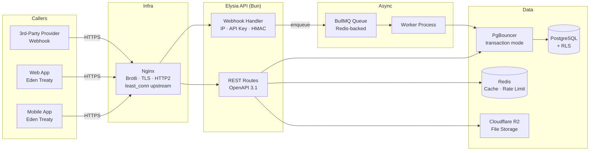
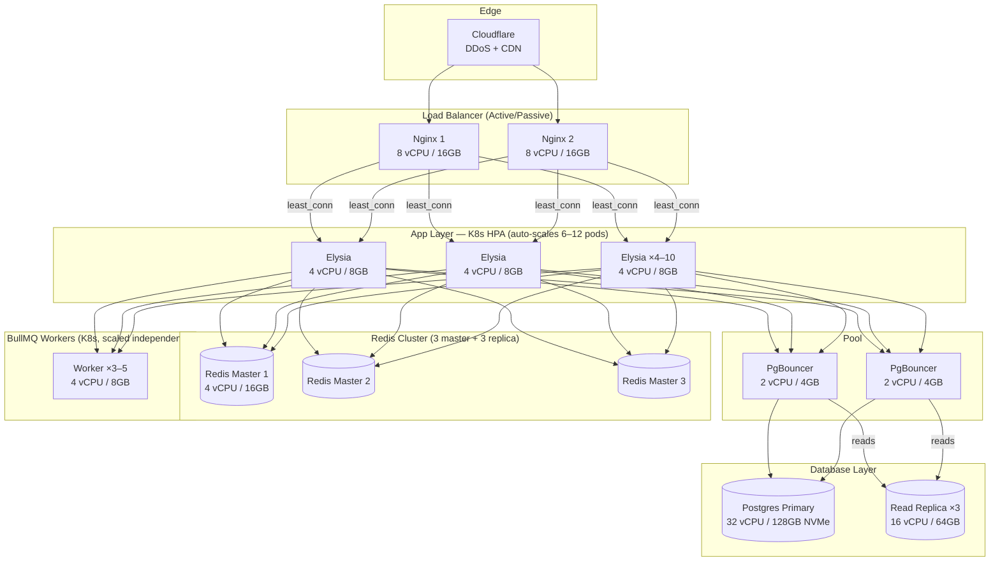

# Infrastructure Stack: Docker Compose + Nginx

Source URL: Internal draft
Collected: 2026-04-15
Published: 2026-04-15
Status: Draft
Scope: Docker Compose, Nginx, Vault, deploy, scalability tiers, and Kubernetes upgrade path

---

## 14. Environment & Secrets

### 14.1 Secrets by environment

Secrets management is tiered by environment:

| Environment | Secrets source | Mechanism |
|---|---|---|
| Local development | `.env` file | `env_file` in Docker Compose |
| Staging | HashiCorp Vault | Injected at container startup via Vault Agent or CI pipeline |
| Production | HashiCorp Vault | Injected at container startup via Vault Agent or CI pipeline |

**Never hardcode secrets, API keys, DSNs, or database URLs in source code.**
**Never bake secrets into Docker images** via `ENV` instructions or build-time `ARG` values.

### 14.2 HashiCorp Vault (staging & production)

**HashiCorp Vault OSS (self-hosted)** is the mandatory secrets manager for staging and production environments. We run the open-source edition in a Docker container on our own infrastructure — zero licensing cost beyond the server we already operate.

**Deployment model:**
- Vault runs as a Docker container, added to the product's infrastructure Docker Compose (or a shared ops Compose stack).
- Storage backend: **PostgreSQL** (reuses the existing database cluster — no additional infrastructure needed).
- Single-node for now. High-availability can be added when the team scales.
- Vault is initialized once and unsealed via auto-unseal (using a cloud KMS key) or a manually stored unseal key held by the designated architecture owner.

Rules:
- Secrets are organized by product and environment: `secret/<product>/<env>/<key>` (e.g., `secret/mini-blast/production/DATABASE_URL`).
- Applications retrieve secrets at startup via the **Vault Agent sidecar** or the **Vault API** (using a short-lived token). Secrets are injected as environment variables, not mounted as files.
- Vault tokens used by the application are short-lived (TTL ≤ 1 hour) and renewed automatically by the Vault Agent. Never use a root or long-lived token in application code.
- Secret rotation is handled in Vault. Application code must not assume a secret is static — it may change between restarts.
- Access policies follow least-privilege: each product's service account can read only its own secrets.
- Vault access credentials for the CI pipeline are stored as **GitHub Actions Secrets** (this is the one permitted use of Actions Secrets for non-trivial values).

### 14.3 `.env` file conventions (local development only)

| File | Purpose |
|---|---|
| `.env` | Local development values (never committed) |
| `.env.example` | Template with all required keys, empty values (committed, kept up to date) |
| `.env.test` | Values for the test environment (committed only if non-sensitive) |

`.env` is in `.gitignore`. The `.env.example` is the source of truth for what variables exist — every new secret added to Vault must also be added (with an empty value) to `.env.example`.

### 14.3 Required environment variables (baseline)

Every product must define at minimum:

```env
# App
APP_ENV=development          # development | staging | production
APP_URL=http://localhost:3000

# Database
DATABASE_URL=postgresql://...

# Auth (Better Auth)
BETTER_AUTH_SECRET=...
BETTER_AUTH_URL=http://localhost:3000

# Redis (if used)
REDIS_URL=redis://localhost:6379

# Monitoring (optional)
SENTRY_ENABLED=false
SENTRY_DSN=
```

---

## 19. Nginx — Reverse Proxy & Compression

Nginx sits in front of **every application adopting this standard** — both the fullstack/frontend app and the backend API. It is the single point of entry for all HTTP traffic and is responsible for compression, security headers, TLS termination, static asset caching, and upstream load balancing.

Nginx is not optional. It is the required outside-facing gateway for every deployed app adopting this stack. TanStack Start, Elysia, or any other application process must never be directly reachable from outside the Docker network in staging or production.

### 19.1 Placement in Docker Compose

Every product's `docker-compose.yml` includes a dedicated Nginx service that proxies to the application container. The app container exposes its port **only internally** (via `expose:`, not `ports:`). Nginx is the only service bound to the host.

The deployment artifact must include both:
- an application image, usually based on `oven/bun`, running TanStack Start or the backend service;
- an Nginx gateway image, based on the approved Nginx+Brotli image, bound to host ports.

The app image must not publish host ports. Direct outside access to the app process bypasses CSP nonce propagation, security headers, Brotli/Gzip compression, static cache rules, rate limiting, and upstream retry behavior.

```
[Client] → [Nginx :80/:443] → [App container :3000]
                            → [PgBouncer :5432] → [Postgres]
                            → [Redis :6379]
```

Required Compose shape:

```yaml
services:
  app:
    image: example-web:${TAG}
    expose:
      - "3000"
    environment:
      APP_ENV: production

  nginx:
    image: example-web-nginx:${TAG}
    ports:
      - "80:80"
      - "443:443"
    environment:
      NGINX_UPSTREAM_HOST: app
      NGINX_UPSTREAM_PORT: 3000
    depends_on:
      - app
```

### 19.2 Docker image: Nginx + Brotli

The standard Nginx Docker image does not include Brotli. Use **`fholzer/nginx-brotli`** as the base image — it ships the `ngx_brotli` module pre-compiled against the latest stable Nginx.

Each product maintains a minimal `nginx/` directory:

```
nginx/
  Dockerfile            — extends fholzer/nginx-brotli, copies entrypoint
  nginx.conf.template   — full Nginx config with ${VARIABLE} placeholders
  entrypoint.sh         — runs envsubst then exec nginx
```

`nginx/Dockerfile`:
```dockerfile
FROM fholzer/nginx-brotli:<pinned-version>
COPY nginx.conf.template /etc/nginx/nginx.conf.template
COPY entrypoint.sh /entrypoint.sh
RUN chmod +x /entrypoint.sh
ENTRYPOINT ["/entrypoint.sh"]
```

`nginx/entrypoint.sh`:
```sh
#!/bin/sh
set -e
envsubst '${NGINX_UPSTREAM_HOST} ${NGINX_UPSTREAM_PORT} ${NGINX_BROTLI_ENABLED}
          ${NGINX_GZIP_ENABLED} ${NGINX_WORKER_PROCESSES} ${NGINX_WORKER_CONNECTIONS}
          ${NGINX_KEEPALIVE_TIMEOUT} ${NGINX_CLIENT_MAX_BODY_SIZE}
          ${NGINX_RATE_LIMIT_RPS} ${NGINX_SSL_ENABLED}
          ${CSP_FRAME_SRC} ${CSP_IMG_SRC} ${CSP_SCRIPT_SRC} ${CSP_CONNECT_SRC}' \
  < /etc/nginx/nginx.conf.template > /etc/nginx/nginx.conf
exec nginx -g 'daemon off;'
```

`nginx/nginx.conf.template`:
```nginx
load_module /usr/lib/nginx/modules/ngx_http_brotli_filter_module.so;
load_module /usr/lib/nginx/modules/ngx_http_brotli_static_module.so;

worker_processes ${NGINX_WORKER_PROCESSES};

events {
    worker_connections ${NGINX_WORKER_CONNECTIONS};
}

http {
    include       /etc/nginx/mime.types;
    default_type  application/octet-stream;

    map ${NGINX_SSL_ENABLED} $hsts_header {
        default "";
        on "max-age=31536000; includeSubDomains";
    }

    sendfile on;
    tcp_nopush on;
    tcp_nodelay on;
    keepalive_timeout ${NGINX_KEEPALIVE_TIMEOUT};
    server_tokens off;

    # Request body / upload limits
    client_max_body_size ${NGINX_CLIENT_MAX_BODY_SIZE};

    # Basic request-rate limiting per IP
    limit_req_zone $binary_remote_addr zone=per_ip:10m rate=${NGINX_RATE_LIMIT_RPS}r/s;

    # Brotli: primary compression
    brotli ${NGINX_BROTLI_ENABLED};
    brotli_comp_level 5;
    brotli_static on;
    brotli_types
        text/plain
        text/css
        text/javascript
        application/javascript
        application/json
        application/xml
        application/rss+xml
        application/atom+xml
        image/svg+xml
        font/woff2;

    # Gzip: fallback for older clients
    gzip ${NGINX_GZIP_ENABLED};
    gzip_comp_level 5;
    gzip_min_length 1024;
    gzip_vary on;
    gzip_proxied any;
    gzip_types
        text/plain
        text/css
        text/javascript
        application/javascript
        application/json
        application/xml
        application/rss+xml
        application/atom+xml
        image/svg+xml;

    upstream app_backend {
        least_conn;
        server ${NGINX_UPSTREAM_HOST}:${NGINX_UPSTREAM_PORT};
        keepalive 64;
    }

    server {
        listen 80;
        server_name _;
        set $csp_nonce $request_id;

        # Security headers are repeated in locations that set their own headers because
        # nginx does not inherit parent add_header directives in that case.
        add_header Content-Security-Policy "default-src 'self'; base-uri 'self'; object-src 'none'; frame-src 'self'; frame-ancestors 'none'; form-action 'self'; img-src 'self' data:; font-src 'self' data:; style-src 'self' 'unsafe-inline'; script-src 'self' 'nonce-$csp_nonce'; connect-src 'self'; upgrade-insecure-requests; trusted-types default" always;
        add_header Strict-Transport-Security $hsts_header always;
        add_header X-Content-Type-Options "nosniff" always;
        add_header X-Frame-Options "DENY" always;
        add_header Referrer-Policy "strict-origin-when-cross-origin" always;
        add_header Permissions-Policy "camera=(), microphone=(), geolocation=()" always;
        add_header Cross-Origin-Opener-Policy "same-origin" always;

        location /health {
            add_header Content-Security-Policy "default-src 'self'; base-uri 'self'; object-src 'none'; frame-src 'self'; frame-ancestors 'none'; form-action 'self'; img-src 'self' data:; font-src 'self' data:; style-src 'self' 'unsafe-inline'; script-src 'self' 'nonce-$csp_nonce'; connect-src 'self'; upgrade-insecure-requests; trusted-types default" always;
            add_header Strict-Transport-Security $hsts_header always;
            add_header X-Content-Type-Options "nosniff" always;
            add_header X-Frame-Options "DENY" always;
            add_header Referrer-Policy "strict-origin-when-cross-origin" always;
            add_header Permissions-Policy "camera=(), microphone=(), geolocation=()" always;
            add_header Cross-Origin-Opener-Policy "same-origin" always;
            proxy_http_version 1.1;
            proxy_set_header Host $host;
            proxy_set_header X-CSP-Nonce $csp_nonce;
            proxy_pass http://app_backend/health;
        }

        location /ready {
            add_header Content-Security-Policy "default-src 'self'; base-uri 'self'; object-src 'none'; frame-src 'self'; frame-ancestors 'none'; form-action 'self'; img-src 'self' data:; font-src 'self' data:; style-src 'self' 'unsafe-inline'; script-src 'self' 'nonce-$csp_nonce'; connect-src 'self'; upgrade-insecure-requests; trusted-types default" always;
            add_header Strict-Transport-Security $hsts_header always;
            add_header X-Content-Type-Options "nosniff" always;
            add_header X-Frame-Options "DENY" always;
            add_header Referrer-Policy "strict-origin-when-cross-origin" always;
            add_header Permissions-Policy "camera=(), microphone=(), geolocation=()" always;
            add_header Cross-Origin-Opener-Policy "same-origin" always;
            proxy_http_version 1.1;
            proxy_set_header Host $host;
            proxy_set_header X-CSP-Nonce $csp_nonce;
            proxy_pass http://app_backend/ready;
        }

        location = /robots.txt {
            add_header Content-Security-Policy "default-src 'self'; base-uri 'self'; object-src 'none'; frame-src 'self'; frame-ancestors 'none'; form-action 'self'; img-src 'self' data:; font-src 'self' data:; style-src 'self' 'unsafe-inline'; script-src 'self' 'nonce-$csp_nonce'; connect-src 'self'; upgrade-insecure-requests; trusted-types default" always;
            add_header Strict-Transport-Security $hsts_header always;
            add_header X-Content-Type-Options "nosniff" always;
            add_header X-Frame-Options "DENY" always;
            add_header Referrer-Policy "strict-origin-when-cross-origin" always;
            add_header Permissions-Policy "camera=(), microphone=(), geolocation=()" always;
            add_header Cross-Origin-Opener-Policy "same-origin" always;
            add_header Cache-Control "public, max-age=3600" always;
            proxy_set_header X-CSP-Nonce $csp_nonce;
            proxy_pass http://app_backend;
        }

        location = /sitemap.xml {
            add_header Content-Security-Policy "default-src 'self'; base-uri 'self'; object-src 'none'; frame-src 'self'; frame-ancestors 'none'; form-action 'self'; img-src 'self' data:; font-src 'self' data:; style-src 'self' 'unsafe-inline'; script-src 'self' 'nonce-$csp_nonce'; connect-src 'self'; upgrade-insecure-requests; trusted-types default" always;
            add_header Strict-Transport-Security $hsts_header always;
            add_header X-Content-Type-Options "nosniff" always;
            add_header X-Frame-Options "DENY" always;
            add_header Referrer-Policy "strict-origin-when-cross-origin" always;
            add_header Permissions-Policy "camera=(), microphone=(), geolocation=()" always;
            add_header Cross-Origin-Opener-Policy "same-origin" always;
            add_header Cache-Control "public, max-age=3600" always;
            proxy_set_header X-CSP-Nonce $csp_nonce;
            proxy_pass http://app_backend;
        }

        location ~* \.(js|css|woff2|woff|ttf|svg|png|jpg|webp|avif|ico)$ {
            expires 1y;
            add_header Content-Security-Policy "default-src 'self'; base-uri 'self'; object-src 'none'; frame-src 'self'; frame-ancestors 'none'; form-action 'self'; img-src 'self' data:; font-src 'self' data:; style-src 'self' 'unsafe-inline'; script-src 'self' 'nonce-$csp_nonce'; connect-src 'self'; upgrade-insecure-requests; trusted-types default" always;
            add_header Strict-Transport-Security $hsts_header always;
            add_header X-Content-Type-Options "nosniff" always;
            add_header X-Frame-Options "DENY" always;
            add_header Referrer-Policy "strict-origin-when-cross-origin" always;
            add_header Permissions-Policy "camera=(), microphone=(), geolocation=()" always;
            add_header Cross-Origin-Opener-Policy "same-origin" always;
            add_header Cache-Control "public, max-age=31536000, immutable" always;
            proxy_set_header X-CSP-Nonce $csp_nonce;
            proxy_pass http://app_backend;
        }

        location / {
            limit_req zone=per_ip burst=40 nodelay;

            proxy_http_version 1.1;
            proxy_set_header Host $host;
            proxy_set_header X-Real-IP $remote_addr;
            proxy_set_header X-Forwarded-For $proxy_add_x_forwarded_for;
            proxy_set_header X-Forwarded-Proto $scheme;
            proxy_set_header X-CSP-Nonce $csp_nonce;
            proxy_set_header Connection "";

            proxy_next_upstream error timeout http_502 http_503 http_504;
            proxy_next_upstream_tries 2;

            add_header Content-Security-Policy "default-src 'self'; base-uri 'self'; object-src 'none'; frame-src 'self'; frame-ancestors 'none'; form-action 'self'; img-src 'self' data:; font-src 'self' data:; style-src 'self' 'unsafe-inline'; script-src 'self' 'nonce-$csp_nonce'; connect-src 'self'; upgrade-insecure-requests; trusted-types default" always;
            add_header Strict-Transport-Security $hsts_header always;
            add_header X-Content-Type-Options "nosniff" always;
            add_header X-Frame-Options "DENY" always;
            add_header Referrer-Policy "strict-origin-when-cross-origin" always;
            add_header Permissions-Policy "camera=(), microphone=(), geolocation=()" always;
            add_header Cross-Origin-Opener-Policy "same-origin" always;
            add_header Cache-Control "public, max-age=0, must-revalidate" always;
            proxy_pass http://app_backend;
        }
    }
}
```

Use this as the baseline template. Products may extend it for TLS certificates, multiple upstreams, product-specific path rules, or additional CSP sources, but Brotli module loading, gzip fallback, upstream proxying, `X-CSP-Nonce` forwarding, nonce-based CSP, and baseline security headers must remain intact. Do not use `if` inside the `server` block for HSTS toggling; use a `map` at the `http` level and feed the result into `add_header`.

#### Default Nginx security template rules

The Nginx security baseline is derived from a production TanStack Start deployment and generalized for reuse. Keep the default policy strict. Do not hardcode analytics, payment, storage, iframe, or regional collection endpoints into the base template.

Default CSP expression:

```nginx
add_header Content-Security-Policy "default-src 'self'; base-uri 'self'; object-src 'none'; frame-src 'self' ${CSP_FRAME_SRC}; frame-ancestors 'none'; form-action 'self'; img-src 'self' data: ${CSP_IMG_SRC}; font-src 'self' data:; style-src 'self' 'unsafe-inline'; script-src 'self' 'nonce-$csp_nonce' ${CSP_SCRIPT_SRC}; connect-src 'self' ${CSP_CONNECT_SRC}; upgrade-insecure-requests; trusted-types default" always;
```

Rules:
- The default values for `CSP_FRAME_SRC`, `CSP_IMG_SRC`, `CSP_SCRIPT_SRC`, and `CSP_CONNECT_SRC` are empty strings.
- Product-specific third-party domains are added only when the project actually uses that provider.
- Every third-party CSP source must be justified in the project ADR or security review.
- Any added `script-src` source must preserve `'nonce-$csp_nonce'`.
- Every Nginx `location` block that defines any `add_header` must repeat the complete security header set, because Nginx does not inherit parent `add_header` directives in that case.
- Nginx must set one request nonce with `set $csp_nonce $request_id;` and forward it with `proxy_set_header X-CSP-Nonce $csp_nonce;` in every proxied location.

Optional provider examples:

```env
# Google Tag Manager, only when used
CSP_SCRIPT_SRC=https://www.googletagmanager.com

# Google Analytics, only when used
CSP_IMG_SRC=https://www.google-analytics.com
CSP_CONNECT_SRC=https://www.google-analytics.com

# Optional regional Google Analytics endpoint. This varies by project and region.
# Add only after verifying the deployed analytics endpoint.
CSP_CONNECT_SRC=https://www.google-analytics.com https://region1.google-analytics.com
```

Do not copy these provider examples into every project by default. Regional endpoints such as `region1.google-analytics.com` are optional and project-specific.

### 19.3 Compression strategy

**Brotli is the primary compression algorithm.** Gzip is the fallback for clients that do not advertise `br` in their `Accept-Encoding` header.

| Algorithm | Compression vs Gzip | Browser support | Use when |
|---|---|---|---|
| **Brotli (`br`)** | ~15–25% smaller | All modern browsers | Default for all responses |
| **Gzip** | Baseline | Universal | Fallback when client does not support Brotli |
| Zstandard (`zstd`) | Comparable to Brotli, faster | Chrome 118+, Firefox 128+ | Revisit in 2027 when support is universal |

Compression applies to: `text/html`, `text/css`, `text/javascript`, `application/json`, `application/javascript`, `image/svg+xml`, `font/woff2`.

Do **not** compress: already-compressed formats (`image/jpeg`, `image/png`, `image/webp`, `image/avif`, `video/*`, `audio/*`, `.gz`, `.zip`).

### 19.4 Runtime-configurable environment variables

All Nginx tuning parameters are injected via environment variables at container startup through `envsubst`. This makes every deployment environment independently configurable without rebuilding the image.

| Variable | Default | Purpose |
|---|---|---|
| `NGINX_UPSTREAM_HOST` | `app` | Docker Compose service name of the app container |
| `NGINX_UPSTREAM_PORT` | `3000` | Port the app container listens on |
| `NGINX_BROTLI_ENABLED` | `on` | Enable/disable Brotli compression (`on` / `off`) |
| `NGINX_GZIP_ENABLED` | `on` | Enable/disable Gzip fallback (`on` / `off`) |
| `NGINX_WORKER_PROCESSES` | `auto` | Nginx worker count (matches CPU cores when `auto`) |
| `NGINX_WORKER_CONNECTIONS` | `1024` | Max simultaneous connections per worker |
| `NGINX_KEEPALIVE_TIMEOUT` | `65` | Keep-alive timeout in seconds |
| `NGINX_CLIENT_MAX_BODY_SIZE` | `10m` | Max request body size (increase for file uploads) |
| `NGINX_RATE_LIMIT_RPS` | `20` | Requests per second per IP before 429 |
| `NGINX_SSL_ENABLED` | `off` | Enable TLS termination at Nginx (`on` in production) |
| `CSP_FRAME_SRC` | empty | Additional frame sources, only when a product embeds trusted frames |
| `CSP_IMG_SRC` | empty | Additional image beacon/CDN sources, only when required |
| `CSP_SCRIPT_SRC` | empty | Additional script sources, only when required and reviewed |
| `CSP_CONNECT_SRC` | empty | Additional API/analytics endpoints, only when required and reviewed |

All variables have sensible defaults. Local development requires only `NGINX_UPSTREAM_HOST` and `NGINX_UPSTREAM_PORT` in `.env`.

### 19.5 Security headers at Nginx level

Baseline shared security headers are applied at the Nginx level. Nginx also owns the baseline nonce-based Content Security Policy and forwards the request nonce to the app with `X-CSP-Nonce`. TanStack Start applications must read that header and pass the same value into TanStack Router SSR (§12.1.1).

Product-specific CSP sources may extend the baseline policy for analytics, payment providers, object storage/CDN hosts, embedded frames, or media providers. These extensions require explicit review and must preserve `script-src 'self' 'nonce-$csp_nonce'`.

The `nginx.conf.template` adds these headers on every response:

```nginx
set $csp_nonce $request_id;
add_header Content-Security-Policy "default-src 'self'; base-uri 'self'; object-src 'none'; frame-src 'self'; frame-ancestors 'none'; form-action 'self'; img-src 'self' data:; font-src 'self' data:; style-src 'self' 'unsafe-inline'; script-src 'self' 'nonce-$csp_nonce'; connect-src 'self'; upgrade-insecure-requests; trusted-types default" always;
add_header Strict-Transport-Security $hsts_header always;
add_header X-Content-Type-Options "nosniff" always;
add_header X-Frame-Options "DENY" always;
add_header Referrer-Policy "strict-origin-when-cross-origin" always;
add_header Permissions-Policy "camera=(), microphone=(), geolocation=()" always;
add_header Cross-Origin-Opener-Policy "same-origin" always;
proxy_set_header X-CSP-Nonce $csp_nonce;
```

Important Nginx behavior: if a `location` block defines any `add_header`, it stops inheriting parent `add_header` directives. Any location that sets caching or other custom headers must repeat the complete security header set.

### 19.6 Static asset caching

Static assets served via Nginx (JS, CSS, fonts, images) must carry aggressive cache headers. Application code generates hashed filenames (TanStack Start / Vite handles this); Nginx caches them permanently.

```nginx
location ~* \.(js|css|woff2|woff|ttf|svg|png|jpg|webp|avif|ico)$ {
    expires 1y;
    add_header Cache-Control "public, max-age=31536000, immutable" always;
    proxy_set_header X-CSP-Nonce $csp_nonce;
}
```

SSR HTML should be revalidated instead of permanently cached:

```nginx
location / {
    add_header Cache-Control "public, max-age=0, must-revalidate" always;
}
```

API responses that contain private, transactional, or user-specific data must still opt into `Cache-Control: no-store` at the application layer.

### 19.7 Upstream load balancing

When multiple app instances are running (e.g., two replicas in Docker Compose), Nginx distributes traffic via `least_conn` (routes to the instance with the fewest active connections — better than round-robin for variable-length requests).

```nginx
upstream app_backend {
    least_conn;
    server ${NGINX_UPSTREAM_HOST}:${NGINX_UPSTREAM_PORT};
    # add more servers here for horizontal scaling
    keepalive 64;  # persistent connections to upstream
}
```

`keepalive 64` keeps 64 persistent connections open to each upstream, eliminating TCP handshake overhead for the majority of requests at 2K+ concurrent load.

---

## 20. Backend API Infrastructure and Scale Sections

### 20.11 Zero-Downtime Deployment (Docker Compose)

Zero-downtime deployment is **mandatory** for all services adopting this standard. Every deploy — no matter how small — must complete without dropping a single in-flight request.

#### Why zero-downtime is not automatic

The core problem is a **race condition** between three independent systems:

```
Pod receives SIGTERM
      │
      ├── App starts draining (stops accepting new requests) ← happens immediately
      │
      └── Docker removes container from compose stack
             ↑
              propagation delay: 1–5 seconds
```

During that propagation gap, Nginx may still route new requests to a container that has stopped accepting connections. The result: `502 Bad Gateway` errors for users.

#### Docker Compose Rolling Update — Single Script

All deployment procedures are consolidated into a single script to prevent skipped or reversed steps. The script is the **only** acceptable way to deploy a service adopting this standard.

**Script location:** `infra/scripts/deploy.sh`

```bash
#!/usr/bin/env bash
# Tech Stacks — Zero-Downtime Docker Compose Deployment Script
# Usage: ./deploy.sh <app_service_name> [health_url] [timeout_seconds]
#
# Defaults:
#   app_service_name : app
#   health_url       : http://localhost/ready
#   timeout_seconds  : 30

set -euo pipefail

APP_SERVICE="${1:-app}"
HEALTH_URL="${2:-http://localhost/ready}"
TIMEOUT="${3:-30}"
HEALTH_CHECK_INTERVAL=2

log() { echo "[$(date '+%Y-%m-%d %H:%M:%S')] $*"; }
error() { echo "[$(date '+%Y-%m-%d %H:%M:%S')] ERROR: $*" >&2; exit 1; }

# Verify health endpoint is reachable before starting
check_prereq() {
    if ! curl -sf "$HEALTH_URL" > /dev/null 2>&1; then
        error "Health endpoint $HEALTH_URL is not reachable. Is the app running?"
    fi
}

# Wait for service to be healthy
wait_for_healthy() {
    local service="$1"
    local count=0
    local max_attempts=$((TIMEOUT / HEALTH_CHECK_INTERVAL))

    log "Waiting for $service to be healthy (timeout: ${TIMEOUT}s)..."
    until curl -sf "$HEALTH_URL" > /dev/null 2>&1; do
        sleep "$HEALTH_CHECK_INTERVAL"
        count=$((count + 1))
        if [ $count -ge $max_attempts ]; then
            error "$service failed to become healthy within ${TIMEOUT}s. Aborting."
        fi
        log "  ... still waiting ($((count * HEALTH_CHECK_INTERVAL))s elapsed)"
    done
    log "$service is healthy."
}

# Verify service is running
verify() {
    log "Verifying deployment..."
    local ps_output
    ps_output=$(docker compose ps "$APP_SERVICE" 2>&1)
    echo "$ps_output"

    if curl -sf "$HEALTH_URL" > /dev/null 2>&1; then
        log "Health check PASSED."
    else
        error "Health check FAILED after deployment."
    fi
}

# Main deploy sequence
main() {
    check_prereq

    log "=== Starting zero-downtime deployment for $APP_SERVICE ==="

    # Step 1: Pull new image without stopping anything
    log "Step 1/5 — Pulling new image..."
    docker compose pull "$APP_SERVICE"

    # Step 2: Scale to 2 instances (old + new running simultaneously)
    log "Step 2/5 — Scaling to 2 instances..."
    docker compose up -d --no-deps --scale "${APP_SERVICE}=2" --no-recreate "$APP_SERVICE"

    # Step 3: Wait for new instance to pass health check
    log "Step 3/5 — Waiting for new instance to be healthy..."
    wait_for_healthy "new instance"

    # Step 4: Scale back to 1 — oldest instance removed
    log "Step 4/5 — Scaling back to 1 instance (old removed)..."
    docker compose up -d --no-deps --scale "${APP_SERVICE}=1" --no-recreate "$APP_SERVICE"

    # Step 5: Verify
    log "Step 5/5 — Verifying deployment..."
    verify

    log "=== Deployment complete — zero downtime achieved ==="
}

# Rollback procedure (call with: ./deploy.sh rollback <service>)
rollback() {
    local service="${1:-app}"
    log "Rolling back $service..."
    docker compose up -d --no-deps --scale "${service}=1" --no-recreate "$service"
    log "Rollback complete."
}

# Parse command
case "${1:-}" in
    rollback) rollback "${2:-app}" ;;
    *) main ;;
esac
```

**Usage:**

```bash
# Standard deploy
./infra/scripts/deploy.sh

# Deploy with custom service name
./infra/scripts/deploy.sh api

# Deploy with custom health URL
./infra/scripts/deploy.sh api http://api:3000/ready

# Rollback to single instance
./infra/scripts/deploy.sh rollback
```

**Rules:**
- Never run `docker compose restart` or `docker compose up` directly for deployments.
- Always use this script. If the script is missing or broken, fix the script first — do not improvise.
- The script must be committed to the repository under `infra/scripts/deploy.sh`.
- Test the script in staging before using in production.

#### Graceful Shutdown — SIGTERM Handler

The app must handle `SIGTERM` from Docker correctly. This is already covered in §20.10, but the sequence is reproduced here for completeness:

```
App receives SIGTERM
  → isShuttingDown = true  (/ready returns 503 immediately)
  → Nginx detects /ready failure → stops routing to this instance
  → App drains in-flight requests (max stop_grace_period: 30s)
  → App exits cleanly (exit code 0)
```

The combined zero-downtime guarantee requires **both** the deploy script (for orchestration) **and** the SIGTERM handler (for app-level drain). Neither alone is sufficient.

### 20.12 Scalability Summary (2K+ Concurrent)

| Component | Limit without mitigation | Mitigation in this stack | Headroom |
|---|---|---|---|
| Bun + Elysia | ~100K req/s | — | Ample |
| Postgres (raw connections) | ~100 concurrent | PgBouncer transaction mode | 2K+ app conns → ~50 Postgres conns |
| Drizzle pool per instance | Unbounded (risk) | `DB_POOL_MAX=20` per instance | Controlled |
| Redis | ~100K ops/s | — | Ample |
| Hot reads hitting Postgres | Collapses under load | Redis query cache (§20.6) | 80–95% cache hit rate on master data |
| Single instance CPU | Saturation at ~5K concurrent | Nginx `least_conn` upstream + horizontal scale | Linear scale-out |
| Response payload size | Bandwidth waste | Nginx Brotli compression (§19) | 15–25% smaller payloads |

A single well-provisioned instance (4 vCPU, 8GB RAM) with this configuration comfortably handles 2K concurrent. For >5K concurrent or zero-downtime deploys, add a second app instance — Nginx's `least_conn` upstream handles distribution automatically with no code changes.

---

### 20.13 Infrastructure Cost Estimation

The infrastructure is designed to scale from 100 to 100K concurrent without architecture changes. Cost scales linearly with concurrency requirements. Orchestration uses Docker Compose until Tier 3 (100K+), where Kubernetes becomes mandatory.

#### Tier 0 — 100 Concurrent (Single VM, Co-located)

| Component | Specification | Count | Purpose |
|---|---|---|---|
| All services | 2 vCPU / 4GB | 1 | Nginx, Elysia app, PgBouncer, PostgreSQL, Redis co-located on single VM |
| **Total** | 2 vCPU / 4GB | 1 VM | |

**Orchestration:** Docker Compose, single VM. All services run on one host — suitable for MVP, prototypes, and early customer validation.

**Estimated cost (DigitalOcean / Vultr):** **$20–$50 USD/month** (~Rp 320–800 ribu)

**When to upgrade:** When a second app instance is needed for zero-downtime deploys, or when database read load requires a dedicated instance.

#### Tier 1 — 2K Concurrent (Docker Compose)

| Component | Specification | Count | Purpose |
|---|---|---|---|
| Nginx | 4 vCPU / 8GB | 1 | Load balancer, Brotli, TLS termination |
| Elysia app | 4 vCPU / 8GB | 1–2 | API server |
| PgBouncer | co-located | 1 | Connection pooling |
| PostgreSQL | 8 vCPU / 32GB SSD | 1 | Primary database |
| Redis | 2 vCPU / 4GB | 1 | Caching, rate limiting, BullMQ |
| **Total** | ~22–44 vCPU / 84–168GB | ~5–7 VMs | |

**Orchestration:** Docker Compose. Scale with `docker compose up -d --scale app=2`.

**Estimated cost (DigitalOcean / Vultr):** **$200–$400 USD/month** (~Rp 3.2–6.4 juta)

#### Tier 1 Architecture — Mermaid Diagram



#### Tier 2 — 10K Concurrent (Docker Compose or Light K8s)

| Component | Specification | Count |
|---|---|---|
| Nginx | 8 vCPU / 16GB | 2 |
| Elysia app | 4 vCPU / 8GB | 4–6 |
| PgBouncer | 2 vCPU / 4GB | 1 |
| PostgreSQL primary | 16 vCPU / 64GB NVMe | 1 |
| PostgreSQL read replica | 8 vCPU / 32GB | 1–2 |
| Redis | 4 vCPU / 8GB | 1 |
| **Total** | ~70–100 vCPU | ~10–13 VMs |

**Orchestration:** Docker Compose with manual scale, or K3s lightweight Kubernetes.

**Estimated cost:** **$800–$1,500 USD/month** (~Rp 12.8–24 juta)

#### Tier 3 — 100K Concurrent (Kubernetes)

| Component | Specification | Count |
|---|---|---|
| Nginx (edge) | 8 vCPU / 16GB | 2 |
| Elysia app (K8s pods with HPA) | 4 vCPU / 8GB | 6–12 |
| PgBouncer | 2 vCPU / 4GB | 2 |
| PostgreSQL primary | 32 vCPU / 128GB NVMe | 1 |
| PostgreSQL read replica | 16 vCPU / 64GB | 3 |
| Redis Cluster (3 master + 3 replica) | 4 vCPU / 16GB | 6 |
| BullMQ workers (K8s) | 4 vCPU / 8GB | 3–5 |
| **Total** | ~150–220 vCPU / 620–760GB | ~23–30 VMs |

**Estimated cost:** **$4,500–$8,000 USD/month** (~Rp 72–128 juta)

#### Cloudflare CDN (all tiers)

Cloudflare Business Plan: **+$200 USD/month**. ROI is highest at scale — absorbs DDoS, caches static assets, reduces origin load.

#### Cost drivers at each tier

| Concurrency | Primary cost driver | Scaling mechanism |
|---|---|---|
| 2K → 10K | Database (read replicas, NVMe) | Add read replicas, PgBouncer pool size |
| 10K → 100K | App instances + Redis Cluster | K8s HPA, Redis Cluster sharding |
| 100K+ | Multi-region, CDN edge | Geo-distributed deployment |

---

### 20.14 Tier 3: Kubernetes Architecture (100K Concurrent)

At 100K concurrent, three new bottlenecks emerge that require Kubernetes orchestration:

#### New bottlenecks at 100K

| Bottleneck | Why it appears | Mitigation |
|---|---|---|
| Single Redis node ceiling | ~100K ops/sec limit hit under full load | Redis Cluster (3 masters + 3 replicas) |
| Single Postgres primary write pressure | Replication lag under sustained write burst | 3–5 read replicas, route reads via PgBouncer |
| Docker Compose not an orchestrator | No autoscale, no rolling deploy, no self-healing | Kubernetes with HPA |
| OS file descriptor limit | Linux default `ulimit -n 1024` hard-stops at ~1K conns | Set `ulimit -n 500000` at OS level |

#### Required Kubernetes manifests

Every Kubernetes `Deployment` for a service adopting this standard must include these exact fields:

```yaml
apiVersion: apps/v1
kind: Deployment
metadata:
  name: api
spec:
  replicas: 3   # never run fewer than 2 in staging, 3 in production

  strategy:
    type: RollingUpdate
    rollingUpdate:
      maxSurge: 1          # spin up 1 extra pod before removing an old one
      maxUnavailable: 0    # NEVER remove a pod unless a healthy replacement is ready

  minReadySeconds: 10      # a new pod must be healthy for 10s before K8s proceeds

  template:
    spec:
      terminationGracePeriodSeconds: 60   # must be > preStop sleep + drain time

      containers:
        - name: api
          image: registry/example-api:${TAG}

          ports:
            - containerPort: 3000

          readinessProbe:
            httpGet:
              path: /ready
              port: 3000
            initialDelaySeconds: 5
            periodSeconds: 5
            failureThreshold: 2
            successThreshold: 1

          livenessProbe:
            httpGet:
              path: /health
              port: 3000
            initialDelaySeconds: 15
            periodSeconds: 10
            failureThreshold: 3

          lifecycle:
            preStop:
              exec:
                # Sleep 5 seconds BEFORE the app receives SIGTERM.
                # This fixes the deregister propagation gap.
                command: ["sleep", "5"]

          resources:
            requests:
              cpu: "500m"
              memory: "512Mi"
            limits:
              cpu: "2000m"
              memory: "1Gi"
```

#### Horizontal Pod Autoscaler (HPA)

```yaml
apiVersion: autoscaling/v2
kind: HorizontalPodAutoscaler
metadata:
  name: api-hpa
spec:
  scaleTargetRef:
    apiVersion: apps/v1
    kind: Deployment
    name: api
  minReplicas: 6
  maxReplicas: 12
  metrics:
    - type: Resource
      resource:
        name: cpu
        target:
          type: Utilization
          averageUtilization: 70
    - type: Resource
      resource:
        name: memory
        target:
          type: Utilization
          averageUtilization: 80
```

#### PodDisruptionBudget (PDB)

```yaml
apiVersion: policy/v1
kind: PodDisruptionBudget
metadata:
  name: api-pdb
spec:
  minAvailable: 2   # always keep at least 2 pods running during voluntary disruptions
  selector:
    matchLabels:
      app: api
```

#### Redis Cluster for 100K+ concurrent

Single-node Redis ceiling is ~100K ops/sec. At 100K concurrent, a Redis Cluster (3 masters + 3 replicas) is required:

```env
REDIS_URL=redis://redis-cluster:6379  # ioredis handles cluster transparently
```

The application code does not change — `ioredis` handles both single-node and cluster URLs with the same interface.

#### OS-level tuning for file descriptors

```bash
# Add to /etc/security/limits.conf or via systemd override
*    soft    nofile    500000
*    hard    nofile    500000
```

This is required on every host running app containers. Without it, the OS will refuse new connections at ~1,024 concurrent connections.

#### What changes from Tier 1 to Tier 3

| Concern | Day 1 (Tier 1) | 100K-ready because… |
|---|---|---|
| Config | All params in `.env` | K8s ConfigMaps/Secrets replace `.env` with no code change |
| DB connection | `DATABASE_URL` → PgBouncer | Adding read replicas = changing one env var |
| Redis | Single node URL | Redis Cluster URL is the same format — `ioredis` handles both |
| App instances | `docker compose scale app=2` | K8s HPA scales pods automatically on CPU/request metrics |
| Nginx upstream | One `server app:3000` line | Add replica entries; `least_conn` already configured |
| Health checks | `/health` + `/ready` endpoints | K8s liveness + readiness probes use these directly |
| Graceful shutdown | SIGTERM handler in app | K8s sends SIGTERM on pod eviction — already handled |

#### Tier 3 Architecture — Mermaid Diagram



---
